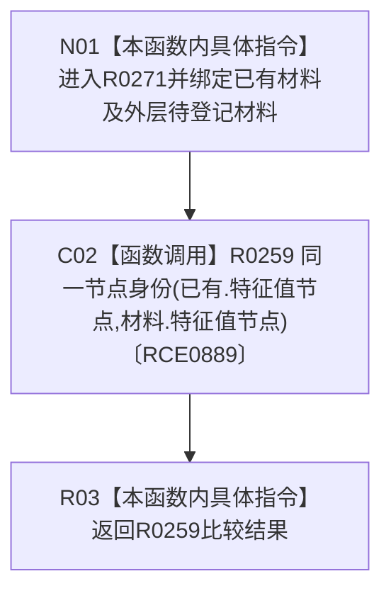

# CF-L15-0007 登记初始材料重复身份lambda现状流程图

图类型：现状流程图
代码版本：`3920a74638264f9f539d50f32f3c9fe5fb1982ab`
源码 blob：`d82fa092a2c1156d2f8de758d5e32415cb64931d`
覆盖文件：`海中鱼巣/领域/参与者.特征值原始材料.ixx:84-86`
唯一根函数：R0271
完整签名：`bool 海中鱼巣::特征值原始材料事务参与者::登记初始材料(海中鱼巣::特征值初始原始材料 材料)::<lambda@参与者.特征值原始材料.ixx:84>::operator()(const 海中鱼巣::特征值初始原始材料& 已有) const`
参数：已有材料以 const 引用借用；闭包以引用捕获外层 `材料` 和 `this`
返回结果：已有材料与待登记材料具有同一稳定节点身份时返回 `true`，否则返回 `false`
已登记调用方：R0270（RCE0888；RCB0021）
直接项目函数：R0259（RCE0889）
外部边界：无；X02074 已停用；未解析项目调用：0
调用图：`流程图/主程序可达调用关系/01_main可达项目调用边表.md`
逐行映射表：`流程图/代码流程图/L15/CF-L15-0007_登记初始材料重复身份lambda_逐行代码映射表.md`
偏差清单：无
依据：RCE0888、RCE0889、RCB0021、X02074 停用裁决与冻结源码
结构读取与写入：只读两份材料的特征值节点，不改变结构
逻辑内返回：节点身份不相同时返回 `false`
不得作为施工许可：是
不得宣称：两个句柄版本相同或材料其它字段相同

## 流程图

## 当前边界

- `std::find_if` 的调用者是 R0270；本 lambda 只承担被回调的比较正文。
