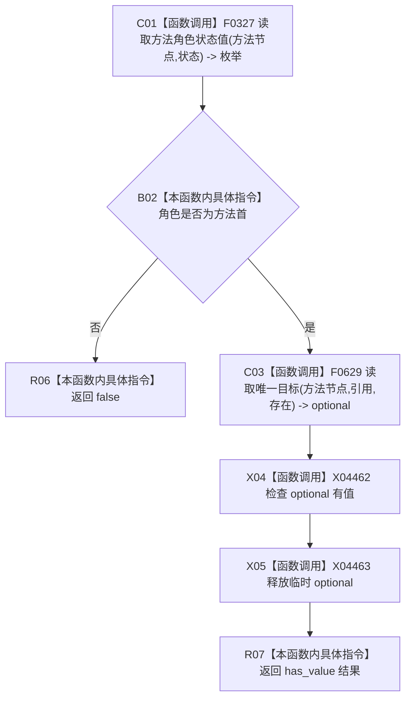

# CF-L15-0008 方法服务方法首基础结构完整现状流程图

代码版本：`3920a74638264f9f539d50f32f3c9fe5fb1982ab`
当前工作区复核基线：`af74e46ef3fd0b1b2c108d695569855909a59ee1`
源码 blob：`839dd462c70e8d54b6f22f1126d751ac9425398a`
图类型：现状流程图
覆盖文件：`海中鱼巣/领域/方法服务.h:1357-1360`
唯一根函数：R0476
完整签名：`bool 海中鱼巣::方法服务::方法首基础结构完整(节点句柄 方法节点, const 状态服务& 状态) const`
参数：方法节点值传入；状态只读借用
返回结果：角色为方法首且存在唯一引用目标时返回 true，否则 false
已登记调用方：R0477
直接项目函数：F0327（RCE1452）、F0629（RCE1453）
稳定外部边界：X04462、X04463
逐行映射表：`流程图/代码流程图/L15/CF-L15-0008_方法服务方法首基础结构完整_逐行代码映射表.md`
不得作为施工许可：是
不得宣称：方法首基础结构满足现行目标模型

## 节点合同

| 节点 | 类型 | 输入 | 输出 / 后继 |
| --- | --- | --- | --- |
| C01 / B02 | 函数调用 / 本函数内具体指令 | 方法节点、状态 | 角色不匹配直接 false |
| C03 | 函数调用 | 方法节点、引用、存在 | 唯一目标 optional |
| X04 / X05 | 函数调用 | 临时 optional | bool，并释放临时量 |
| R06 / R07 | 本函数内具体指令 | 短路或 has_value 结果 | bool |

## 关键边界

- 本函数使用旧方法角色状态和通用引用关系进行窄复核，零结构写入。
- 在 R0477 的已加锁登记读取语境中，false 会被收口为空登记项；本函数不报告具名原因。
