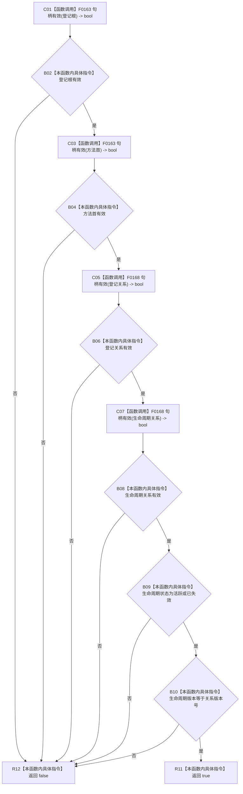

# CF-L15-0009 方法登记项材料完整现状流程图

代码版本：`0a93526882cb33c61c2fbb04ecad1aeaddcfe225`
当前工作区复核基线：`ece29318f80cad2ce7a4abce9b009c60cd4cdfdd`
源码 blob：`839dd462c70e8d54b6f22f1126d751ac9425398a`
图类型：现状流程图
覆盖文件：`海中鱼巣/领域/方法服务.h:156-164`
唯一根函数：R0478
完整签名：`bool 海中鱼巣::方法登记项材料::完整() const`
参数：无显式参数；`this` 为只读材料借用
返回结果：四个句柄有效、生命周期状态为活跃或已失效且版本相等时返回 true，否则返回 false
调用图：入边 RCE1457；出边 RCE1458、RCE1459；删除错误边建议 RCE1460
逐行映射表：`流程图/代码流程图/L15/CF-L15-0009_方法登记项材料完整_逐行代码映射表.md`
输入契约 / 调用语境表：本图“关键边界”内嵌记录 R0477 的值式材料复核语境
非成功返回二分审查表：本图“关键边界”内嵌记录 false 为调用方空登记项分支
偏差清单：RCE1459 调用点需校正为 159、160；RCE1460 的主信息句柄重载与字段静态类型不符，应删除
依据提交 / 结构化消息：冻结源码、当前身份表、既有边与本批逐调用点静态类型复核
验证输出：本批不运行构建或程序
不得作为施工许可：是
不得宣称：材料完整性谓词符合现行目标模型或登记能力完成

## 节点合同

| 节点组 | 类型 | 输入 | 结果 / 后继 |
| --- | --- | --- | --- |
| C01—B08 | 函数调用 / 本函数内具体指令 | 四个句柄字段 | 任一无效即短路 false |
| B09 | 本函数内具体指令 | 生命周期状态 | 只接受活跃或已失效 |
| B10—R12 | 本函数内具体指令 | 生命周期版本、关系版本号 | 相等返回 true，否则 false |

## 关键边界

- R0477 在组装只读值式材料后调用本函数；false 被调用方折叠为空 optional，不产生结构写入。
- `登记关系` 与 `生命周期关系` 均为 `关系句柄`，只解析到 F0168；不存在 F0565 主信息句柄重载调用。
