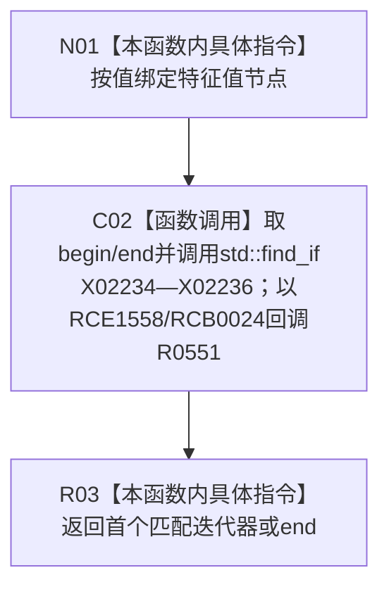

# CF-L15-0010 查找I64版本记录已加锁可写重载现状流程图

图类型：现状流程图
代码版本：`0a93526882cb33c61c2fbb04ecad1aeaddcfe225`
工作区复核基线：`2089268fbb3833ebc77486169b98d8a14c49d508`
源码 blob：`be8c82c78253b3bc7d3f4aa15a93660e0025bb06`
覆盖文件：`海中鱼巣/领域/特征值服务.h:685-689`
唯一根函数：R0550
完整签名：`std::vector<海中鱼巣::特征值服务::I64版本记录>::iterator 海中鱼巣::特征值服务::查找I64版本记录_已加锁(海中鱼巣::节点句柄 特征值节点)`
参数：`特征值节点` 按值输入；函数名要求调用方已持有适当锁，函数体不自行验证锁状态
返回结果：返回首个节点句柄匹配的可写 I64 版本记录迭代器；无匹配时返回 `I64版本记录表_.end()`
已登记调用方：R0264（RCE0876）
直接项目函数：R0551（RCE1558；由 RCB0024 在 `std::find_if` 内零到多次回调）
外部边界：X02234—X02236
逐行映射表：`流程图/代码流程图/L15/CF-L15-0010_查找I64版本记录已加锁可写重载_逐行代码映射表.md`
结构读写：只读 I64 版本记录表并返回可写迭代器，本函数不直接改写记录
不得作为施工许可：是
不得宣称：返回迭代器在锁释放或容器修改后仍有效

## 流程图

## 当前边界

- `std::find_if` 的区间与算法调用属于 R0550；lambda 正文由 R0551 独立覆盖。
- 正式当前可达图只登记 R0264 为调用方；源码中其它调用若所在根函数不可达，不据此扩张当前可达边。
