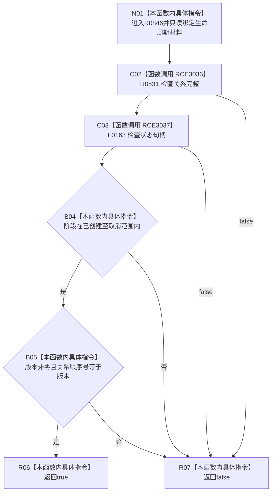

# CF-L15-0012 任务生命周期材料完整现状流程图

图类型：现状流程图
代码版本：`03a8b7ac099ccea83e57f2696e2290b7bcdfacaf`
当前工作区复核基线：`4e0ac10ae3b18404ff2b623faa0fb006fa0fc7a1`
源码 blob：`16ac9534baeda26ac8a712066e713f3339f6e0c8`
覆盖文件：`海中鱼巣/领域/数据操作.需求任务方法.ixx:216-221`
唯一根函数：R0846
完整签名：`bool 海中鱼巣::任务生命周期材料::完整() const noexcept`
参数：无显式参数；只读生命周期材料
返回结果：关系完整、状态句柄有效、阶段在范围内、版本非零且关系顺序号等于版本时返回 true，否则 false
调用图：`流程图/主程序可达调用关系/00_main可达函数身份表.md`、`01_main可达项目调用边表.md`、`02_main可达外部边界表.md`
已登记调用方：R0843
直接项目函数：R0831（RCE3036）、F0163（RCE3037）
外部边界：无
逐行映射表：`流程图/代码流程图/L15/CF-L15-0012_任务生命周期材料完整_逐行代码映射表.md`
不得作为施工许可：是
不得宣称：材料完整证明生命周期为当前有效状态

## 流程图

## 当前边界

- 本函数不检查记录阶段是否有效；该当前性判断由 R0843 追加。
