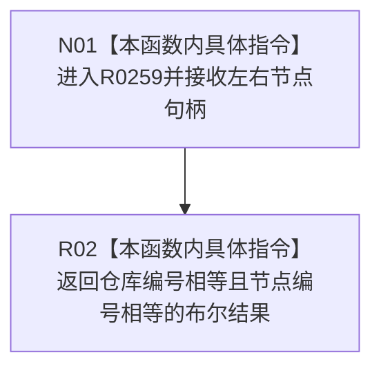

# CF-L16-0002 同一节点身份现状流程图

图类型：现状流程图
代码版本：`3920a74638264f9f539d50f32f3c9fe5fb1982ab`
源码 blob：`d82fa092a2c1156d2f8de758d5e32415cb64931d`
覆盖文件：`海中鱼巣/领域/参与者.特征值原始材料.ixx:101-103`
唯一根函数：R0259
完整签名：`static bool 海中鱼巣::特征值原始材料事务参与者::同一节点身份(海中鱼巣::节点句柄 左, 海中鱼巣::节点句柄 右)`
参数：左右节点句柄均按值传入
返回结果：仓库编号和节点编号均相等时返回 `true`，否则返回 `false`；版本号不参与比较
已登记调用方：R0271（RCE0889）
直接项目函数：无
外部边界：无；未解析项目调用：0
调用图：`流程图/主程序可达调用关系/01_main可达项目调用边表.md`
逐行映射表：`流程图/代码流程图/L16/CF-L16-0002_同一节点身份_逐行代码映射表.md`
偏差清单：无
依据：RCE0889 与冻结源码
结构读取与写入：只读取两个句柄值，不改变任何结构
逻辑内返回：比较结果为假
不得作为施工许可：是
不得宣称：节点版本相同、节点当前有效或两句柄完全相等

## 流程图

## 当前边界

- 本函数只比较跨版本稳定节点身份，不比较版本号。
