# CF-L2-0002 `运行普通程序` 现状流程图

图类型：现状流程图
代码版本：`4b80f1617dd70ec7a19e1a34efa9da768dce8927`
源码 blob：`d2581161faef19cb494366ee32886ae2b12ee190`
覆盖文件：`海中鱼巣/启动.应用程序.ixx:49-113`
唯一根函数：F0007
完整签名：`海中鱼巣::程序运行结果 海中鱼巣::运行普通程序(海中鱼巣::启动模式 模式)`
参数：`模式` 按值传入，仅接受普通控制面板或无窗口常驻
返回结果：结构化装配、初始化、宿主或成功结果
调用图：`流程图/代码流程图/00_调用知识图谱.md`
逐行映射表：`流程图/代码流程图/L2/CF-L2-0002_运行普通程序_逐行代码映射表.md`
输入契约 / 调用语境表：F0005 只在两种普通模式分支调用；上下文由装配结果唯一拥有
非成功返回二分审查表：无效模式、装配失败和信号失败为逻辑内返回；生产初始化失败及成功初始化后的投影失败需追根因
偏差清单：`流程图/代码流程图/00_规范偏差审计.md`
依据提交 / 结构化消息：冻结源码提交 `4b80f1617dd70ec7a19e1a34efa9da768dce8927`
验证输出：配对图、调用端点和逐行覆盖由本目录机械校验
不得作为施工许可：是
不得宣称：最佳努力审计成功是普通启动成功的必要条件

```mermaid
flowchart TD
    N00["N00【本函数内具体指令】进入函数并绑定模式"]
    N01{"N01【本函数内具体指令】判断模式是否不是普通控制面板"}
    N02{"N02【本函数内具体指令】短路后判断模式是否不是无窗口常驻"}
    N03["N03【本函数内具体指令】返回内部不一致结果"]
    N04["N04【本函数内具体指令】默认初始化普通应用配置"]
    N05["N05【函数调用】F0013 构造普通应用上下文(配置) → 装配候选"]
    N06["N06【本函数内具体指令】以调用结果初始化装配"]
    N07["N07【函数调用】F0014 装配.成功() → 装配成功"]
    N08{"N08【本函数内具体指令】判断装配成功"}
    N09["N09【本函数内具体指令】返回装配失败结果"]
    N10["N10【函数调用】std::unique_ptr::operator*() → 上下文对象"]
    N11["N11【本函数内具体指令】绑定上下文引用"]
    N12["N12【本函数内具体指令】构造方法登记根回调"]
    N13["N13【本函数内具体指令】构造启动自我线程回调"]
    N14["N14【本函数内具体指令】构造等待初始化回调"]
    N15["N15【本函数内具体指令】构造读取初始化快照回调"]
    N16["N16【本函数内具体指令】构造初始化概念图四根回调"]
    N17["N17【本函数内具体指令】构造存在根支持回调并完成系统端口"]
    N18["N18【函数调用】F0015 初始化普通系统(系统端口, 初始化请求) → 初始化候选"]
    N19["N19【本函数内具体指令】以调用结果初始化初始化变量"]
    N20["N20【函数调用】F0016 初始化.成功() → 初始化成功"]
    N21{"N21【本函数内具体指令】判断初始化成功"}
    N22["N22【函数调用】F0017 失败阶段映射lambda() → 阶段候选"]
    N23["N23【本函数内具体指令】保存失败阶段"]
    N24["N24【本函数内具体指令】返回初始化失败结果"]
    N25["N25【本函数内具体指令】构造统计命名空间回调"]
    N26["N26【本函数内具体指令】构造权威统计快照回调"]
    N27["N27【本函数内具体指令】构造数据库写入回调"]
    N28["N28【本函数内具体指令】构造数据库读回回调并完成审计端口"]
    N29["N29【函数调用】F0018 执行启动结构审计(审计端口, 最佳努力) → 审计候选"]
    N30["N30【本函数内具体指令】以调用结果初始化审计"]
    N31["N31【函数调用】F0019 安装程序停止信号(默认安装函数) → 信号候选"]
    N32["N32【本函数内具体指令】以调用结果初始化信号"]
    N33["N33【函数调用】F0020 信号.成功() → 信号成功"]
    N34{"N34【本函数内具体指令】判断信号成功"}
    N35["N35【本函数内具体指令】返回停止信号宿主失败"]
    N36{"N36【本函数内具体指令】判断模式是否为无窗口常驻"}
    N37["N37【函数调用】std::unique_ptr::operator*() → 普通应用上下文"]
    N38["N38【函数调用】std::unique_ptr::operator*() → 停止信号租约"]
    N39["N39【函数调用】F0021 运行无窗口宿主(上下文, 信号租约) → 运行结果"]
    N40["N40【本函数内具体指令】收口局部生命周期并返回运行结果"]
    N41["N41【函数调用】std::unique_ptr::operator*() → 普通应用上下文"]
    N42["N42【函数调用】F0022 生成控制面板启动投影(上下文, 初始化) → 投影候选"]
    N43["N43【本函数内具体指令】以调用结果初始化投影"]
    N44["N44【函数调用】F0023 投影.成功() → 投影成功"]
    N45{"N45【本函数内具体指令】判断投影成功"}
    N46["N46【本函数内具体指令】返回控制面板投影失败"]
    N47["N47【函数调用】std::unique_ptr::operator*() → 普通应用上下文"]
    N48["N48【函数调用】std::unique_ptr::operator*() → 停止信号租约"]
    N49["N49【函数调用】F0024 运行控制面板宿主(上下文, 初始化, 投影, 审计, 信号租约) → 运行结果"]
    N50["N50【本函数内具体指令】收口局部生命周期并返回运行结果"]
    N00 --> N01
    N01 -- "否；普通控制面板" --> N04
    N01 -- "是" --> N02
    N02 -- "是" --> N03
    N02 -- "否；无窗口常驻" --> N04
    N04 --> N05 --> N06 --> N07 --> N08
    N08 -- "否" --> N09
    N08 -- "是" --> N10 --> N11 --> N12 --> N13 --> N14 --> N15 --> N16 --> N17
    N17 --> N18 --> N19 --> N20 --> N21
    N21 -- "否" --> N22 --> N23 --> N24
    N21 -- "是" --> N25 --> N26 --> N27 --> N28 --> N29 --> N30 --> N31 --> N32 --> N33 --> N34
    N34 -- "否" --> N35
    N34 -- "是" --> N36
    N36 -- "是" --> N37 --> N38 --> N39 --> N40
    N36 -- "否" --> N41 --> N42 --> N43 --> N44 --> N45
    N45 -- "否" --> N46
    N45 -- "是" --> N47 --> N48 --> N49 --> N50
```

## 函数与节点确认

| 节点组 | 类型 | 当前行为 | 数据 / 生命周期 |
| --- | --- | --- | --- |
| N00-N04 | 本函数内具体指令 | 拒绝非普通模式并建立默认配置 | 无机器结构变化 |
| N05/N07 | 函数调用 | F0013 装配上下文；F0014 查询结果 | 装配结果唯一拥有上下文 |
| N08-N11 | 指令 / 外部边界 | 分支、失败返回或解引用并绑定上下文 | `unique_ptr::operator*` 为外部边界 |
| N12-N17 | 本函数内具体指令 | 按字段顺序构造六个系统初始化端口回调 | 回调只借用上下文，生命周期不超过本函数 |
| N18/N20 | 函数调用 | F0015 运行生产初始化；F0016 查询结果 | 初始化请求绑定稳定键与根需求参数 |
| N21-N24 | 指令 / 函数调用 | 失败时立即调用 F0017 映射阶段并返回 | 失败阶段来自结构化初始化状态 |
| N25-N28 | 本函数内具体指令 | 构造四个数据库审计端口回调 | 回调只借用上下文 |
| N29 | 函数调用 | F0018 执行最佳努力审计 | 审计失败不阻断普通启动 |
| N31/N33 | 函数调用 | F0019 安装信号；F0020 查询结果 | 租约由结果唯一拥有 |
| N34-N40 | 指令 / 函数调用 | 失败返回或进入 F0021 headless 宿主 | 返回前调用 F0025 结束信号租约生命周期 |
| N41-N50 | 指令 / 函数调用 | 生成投影并进入 F0024 UI 宿主 | 投影只读；返回前调用 F0025 收口信号租约 |

直接项目源码调用点：12；另有显式项目析构 F0025 在各返回路径完成自动对象生命周期收口。外部边界调用点：4 个 `std::unique_ptr::operator*()`。未解析调用：0。

十个单调用适配 lambda 只绑定端口，不单独制图；其实际项目目标在被调端口函数图中记录。F0017 为含 `switch` 的非平凡立即调用 lambda，单独入队制图。

## 当前规范审计

与 `8120` 第 5—8 节一致：普通程序按装配、生产初始化、最佳努力审计、信号宿主顺序执行；headless 不生成控制面板投影；审计失败不改变普通启动成功裁决。
