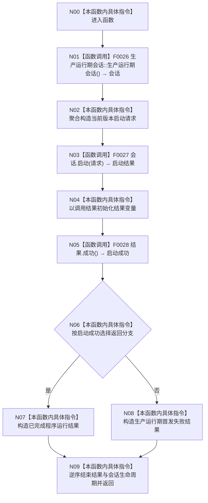

# CF-L2-0003 `运行生产运行期模式` 现状流程图

图类型：现状流程图
代码版本：`a48a70b2d678dea64dd8228adb4f26f0badd9506`
覆盖文件：`海中鱼巣/启动.应用程序.ixx:36-44`
唯一根函数：F0008
完整签名：`海中鱼巣::程序运行结果 海中鱼巣::运行生产运行期模式()`
参数：无
返回结果：会话启动成功返回已完成；失败返回生产运行期首发专项失败
调用图：`流程图/代码流程图/00_调用知识图谱.md`
逐行映射表：`流程图/代码流程图/L2/CF-L2-0003_运行生产运行期模式_逐行代码映射表.md`
输入契约 / 调用语境表：仅由 F0005 的生产运行期分支调用
非成功返回二分审查表：会话启动失败在结构已进入启动协议后属于追根因解决
偏差清单：`流程图/代码流程图/00_规范偏差审计.md`
依据提交 / 结构化消息：Git 提交 `a48a70b2d678dea64dd8228adb4f26f0badd9506`
验证输出：配对图、调用端点和逐行覆盖由本目录机械校验
不得作为施工许可：是
不得宣称：包装函数成功不替代会话内部首发验证

## 函数与节点确认

| 节点 | 类型 | 当前行为 | 参数 / 返回绑定 | 结构变化 |
| --- | --- | --- | --- | --- |
| N00 | 本函数内具体指令 | 进入无参包装函数 | 无 | 无 |
| N01 | 函数调用 | 显式默认构造 F0026 | 无 → `会话` | 会话成员初始化 |
| N02 | 本函数内具体指令 | 聚合构造 `生产运行期启动请求{}` | 版本取当前版本 | 无 |
| N03 | 函数调用 | 调用 F0027 启动会话 | `this=&会话, 请求` → 启动结果 | 被调函数裁决 |
| N04 | 本函数内具体指令 | 初始化局部结果 | 启动结果 → `结果` | 无新增 |
| N05 | 函数调用 | 调用 F0028 查询结构化成功状态 | `this=&结果` → bool | 无 |
| N06 | 本函数内具体指令 | 对成功状态分支 | bool | 无 |
| N07 | 本函数内具体指令 | 构造成功返回对象 | 生产运行期、已完成、无、空专项 | 无新增 |
| N08 | 本函数内具体指令 | 构造失败返回对象 | 生产运行期、专项失败、首发、空专项 | 无新增 |
| N09 | 本函数内具体指令 | 结束局部生命周期并返回已形成对象 | 返回值 | 会话负责其成员收口 |

项目源码出边：3。外部边界：`std::optional<程序专项摘要>` 空值构造 2 个调用点。未解析调用：0。

## 当前规范审计

与 `8120` 第 5 节生产运行期合同一致：使用当前版本请求调用结构化会话启动接口，并把启动结果映射为程序运行结果；日志不参与裁决。
