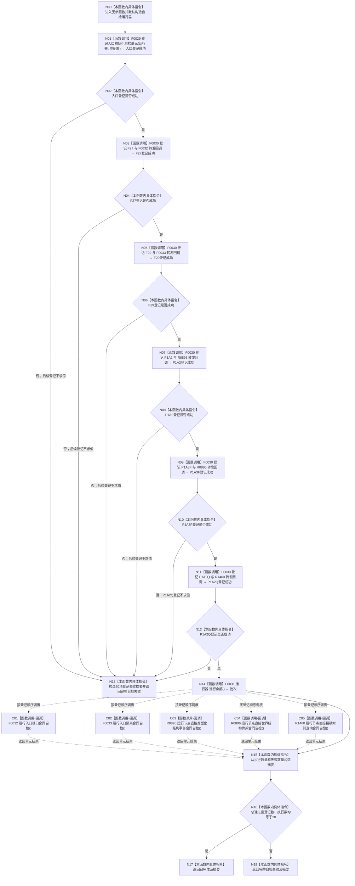

# CF-L2-0004 `运行完整自检模式` 现状流程图

图类型：现状流程图
代码版本：`4b80f1617dd70ec7a19e1a34efa9da768dce8927`
源码 blob：`d2581161faef19cb494366ee32886ae2b12ee190`
覆盖文件：`海中鱼巣/启动.应用程序.ixx:400-425`
唯一根函数：F0009
完整签名：`海中鱼巣::程序运行结果 海中鱼巣::运行完整自检模式()`
参数：无
返回结果：20 项登记和执行均满足合同则返回已完成；任一登记失败或批次不满足合同则返回完整自检失败
调用图：`流程图/代码流程图/00_调用知识图谱.md`
逐行映射表：`流程图/代码流程图/L2/CF-L2-0004_运行完整自检模式_逐行代码映射表.md`
输入契约 / 调用语境表：仅由 F0005 的显式完整自检模式分支调用
非成功返回二分审查表：登记失败或批次失败均为显式自检协议内结构化失败，不写生产机器事实
偏差清单：`流程图/代码流程图/00_规范偏差审计.md`
依据提交 / 结构化消息：冻结源码提交 `4b80f1617dd70ec7a19e1a34efa9da768dce8927`
验证输出：配对图、短路分支、回调身份和逐行覆盖由本目录机械校验
不得作为施工许可：是
不得宣称：登记成功不等于自检执行通过；自检通过不等于生产能力完成

## 函数与节点确认

| 节点组 | 类型 | 当前行为 | 调用 / 结果 |
| --- | --- | --- | --- |
| N00-N12 | 指令 / 函数调用 | 左到右短路登记入口15项及 F27、F29、P1A2、P1A3F、P1A2Q | F0029 一次、F0030 五次 |
| N13 | 本函数内具体指令 | 任一登记失败即形成固定失败摘要并返回 | 登记目标20、失败1 |
| N14、C01-C05 | 函数调用 / 回调 | F0031 按登记顺序执行全部回调 | 五个稳定回调目标 |
| N15-N18 | 本函数内具体指令 | 构造摘要并核对总通过、20项登记和20项执行 | 返回已完成或自检失败 |

五个无捕获 lambda 均为单调用转发适配器，注册时不执行；当前图谱按既有口径不为转发器另分配身份，而以 F0032、F0033、R0895、R0896、R1460 记录最终回调目标。直接项目源码调用点7个，稳定回调目标5个，未解析调用0个。

## 当前规范审计

当前代码只在显式完整自检模式登记并运行15个入口初始化单元及 F27、F29、P1A2、P1A3F、P1A2Q，共20项；普通程序、数据库、性能和 D455 不在此函数中运行。
