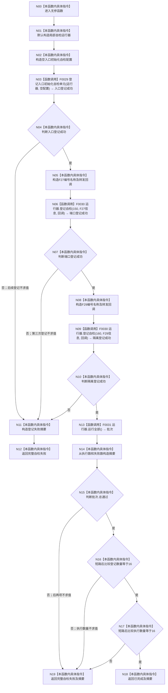

# CF-L2-0004 `运行完整自检模式` 现状流程图

图类型：现状流程图
代码版本：`a48a70b2d678dea64dd8228adb4f26f0badd9506`
覆盖文件：`海中鱼巣/启动.应用程序.ixx:379-398`
唯一根函数：F0009
完整签名：`海中鱼巣::程序运行结果 海中鱼巣::运行完整自检模式()`
参数：无
返回结果：16 项登记和执行均满足合同则返回已完成，否则返回完整自检失败
调用图：`流程图/代码流程图/00_调用知识图谱.md`
逐行映射表：`流程图/代码流程图/L2/CF-L2-0004_运行完整自检模式_逐行代码映射表.md`
输入契约 / 调用语境表：仅由 F0005 的显式完整自检模式分支调用
非成功返回二分审查表：登记失败或批次失败均为显式自检协议内结构化失败，不写生产机器事实
偏差清单：`流程图/代码流程图/00_规范偏差审计.md`
依据提交 / 结构化消息：Git 提交 `a48a70b2d678dea64dd8228adb4f26f0badd9506`
验证输出：配对图、短路分支、回调身份和逐行覆盖由本目录机械校验
不得作为施工许可：是
不得宣称：登记成功不等于自检执行通过

## 函数与节点确认

| 节点组 | 类型 | 当前行为 | 调用 / 结果 |
| --- | --- | --- | --- |
| N00-N02 | 本函数内具体指令 | 建立局部运行器和空配置 | 不写生产机器事实 |
| N03 | 函数调用 | F0029 登记入口 S01-S14 | bool |
| N04-N10 | 指令 / 函数调用 | 严格短路登记 F27、F29 | 两个调用点均为 F0030 |
| N11-N12 | 本函数内具体指令 | 任一登记失败即形成固定失败摘要并返回 | 登记目标 16、失败 1 |
| N13 | 函数调用 | F0031 按登记顺序执行全部回调 | `批次` |
| N14-N19 | 本函数内具体指令 | 构造摘要并严格短路核对三项完成合同 | 返回已完成或自检失败 |

F27 与 F29 的无捕获 lambda 是单调用转发适配器：分别稳定绑定 F0032 `运行入口端口合同自检()` 和 F0033 `运行入口隔离合同自检()`；注册时不执行，F0031 调度到相应顺序时才调用。按“非平凡 lambda 单独制图”口径不为这两个转发 lambda 建图，但保留回调绑定与调用边。

直接项目源码调用点：4（3 个唯一直接函数）；回调最终目标：2。外部边界包括 `std::string`、`std::function` 与 `std::optional` 构造。未解析调用：0。

## 当前规范审计

与 `8120` 第 5、9 节一致：只有显式完整自检模式登记并运行 14 个入口初始化单元及 F27/F29；普通程序、数据库、性能和 D455 不在此函数中运行。
