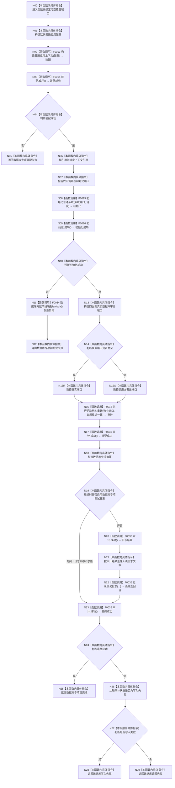

# CF-L2-0005 `运行数据库专项` 现状流程图

图类型：现状流程图
代码版本：`4b80f1617dd70ec7a19e1a34efa9da768dce8927`
源码 blob：`d2581161faef19cb494366ee32886ae2b12ee190`
覆盖文件：`海中鱼巣/启动.应用程序.ixx:115-177`
唯一根函数：F0010
完整签名：`海中鱼巣::程序运行结果 海中鱼巣::运行数据库专项(const 海中鱼巣::数据库启动审计端口* 覆盖端口 = nullptr)`
参数：`覆盖端口` 为同步调用期内的可空只读借用
返回结果：装配/初始化失败、严格数据库往返成功或审计失败的结构化结果
调用图：`流程图/代码流程图/00_调用知识图谱.md`
逐行映射表：`流程图/代码流程图/L2/CF-L2-0005_运行数据库专项_逐行代码映射表.md`
输入契约 / 调用语境表：F0005 使用默认空端口；自检可注入覆盖端口而不执行真实数据库回调
非成功返回二分审查表：装配与显式审计失败为逻辑内结果；生产初始化内部失败需追根因
偏差清单：`流程图/代码流程图/00_规范偏差审计.md`
依据提交 / 结构化消息：冻结源码提交 `4b80f1617dd70ec7a19e1a34efa9da768dce8927`
验证输出：配对图、条件端口选择、日志宏和逐行覆盖由本目录机械校验
不得作为施工许可：是
不得宣称：数据库读回成功是核心系统初始化成功条件

## 函数与节点确认

| 节点组 | 类型 | 当前行为 | 关键合同 |
| --- | --- | --- | --- |
| N00-N07 | 指令 / 函数调用 | 装配上下文并形成初始化端口 | 复用 F0013/F0014 |
| N08-N12 | 函数调用 / 指令 | 生产初始化；失败时调用非平凡 F0034 映射阶段 | 复用 F0015/F0016 |
| N13-N16 | 指令 / 函数调用 | 形成真实审计端口，按空指针选择真实或覆盖端口，调用 F0018 | 覆盖端口目标不猜测 |
| N17-N18 | 函数调用 / 指令 | F0035 查询审计结果并形成 1 项摘要 | 结果可用恒为 true |
| N19-N22 | 指令 / 函数调用 | 具名宏开时才查询日志文本并调用 F0036 | 日志返回不参与裁决；关时实参不求值 |
| N23-N29 | 函数调用 / 指令 | 再次查询审计结果并映射成功、写入失败或读回失败 | 结构化返回 |

六个系统端口与四个真实数据库端口的单调用适配 lambda 不单独制图；其同步目标在 F0015/F0018 的回调调用图中记录。直接项目源码调用点：10（7 个唯一函数）。外部边界：`unique_ptr::operator*`、`std::function`、`std::move`。未解析调用：0。

## 当前规范审计

与 `8120` 第 7、9 节一致：数据库专项先完成核心生产初始化，再执行必须往返一致审计；覆盖端口支持隔离验证；统一日志宏不承载机器事实。
