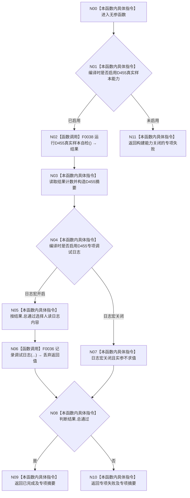

# CF-L2-0007 `运行D455真实样本专项` 现状流程图

图类型：现状流程图
代码版本：`a48a70b2d678dea64dd8228adb4f26f0badd9506`
覆盖文件：`海中鱼巣/启动.应用程序.ixx:429-447`
唯一根函数：F0012
完整签名：`海中鱼巣::程序运行结果 海中鱼巣::运行D455真实样本专项()`
参数：无
返回结果：能力开启时按结构化真实样本自检结果返回已完成或专项失败；关闭时防御性返回专项失败
调用图：`流程图/代码流程图/00_调用知识图谱.md`
逐行映射表：`流程图/代码流程图/L2/CF-L2-0007_运行D455真实样本专项_逐行代码映射表.md`
输入契约 / 调用语境表：F0005 仅在 D455 显式专项模式调用；正常入口在能力宏关闭时已提前拒绝
非成功返回二分审查表：真实样本专项失败与能力关闭均为无生产半结构的逻辑内结果
偏差清单：`流程图/代码流程图/00_规范偏差审计.md`
依据提交 / 结构化消息：Git 提交 `a48a70b2d678dea64dd8228adb4f26f0badd9506`
验证输出：配对图、双宏变体和逐行覆盖由本目录机械校验
不得作为施工许可：是
不得宣称：调试日志成功是 D455 专项通过依据

## 函数与节点确认

| 节点组 | 类型 | 当前行为 |
| --- | --- | --- |
| N00-N02 | 指令 / 函数调用 | 按 D455 能力宏选择；开启时调用 F0038 |
| N03 | 本函数内具体指令 | 以验收项数、失败项数构造结构化摘要 |
| N04-N07 | 指令 / 函数调用 | 具名日志宏开时调用 F0036；关时所有日志实参不求值 |
| N08-N10 | 本函数内具体指令 | 只按 `结果.总通过` 返回已完成或专项失败 |
| N11 | 本函数内具体指令 | 能力未编译时防御性返回无摘要专项失败 |

项目源码出边：2。外部边界：0。未解析调用：0。

## 当前规范审计

与 `8120` 第 5、9 节一致：D455 真实样本只由显式专项模式调用，机器裁决来自结构化自检结果，具名日志宏关闭时实参不求值。
