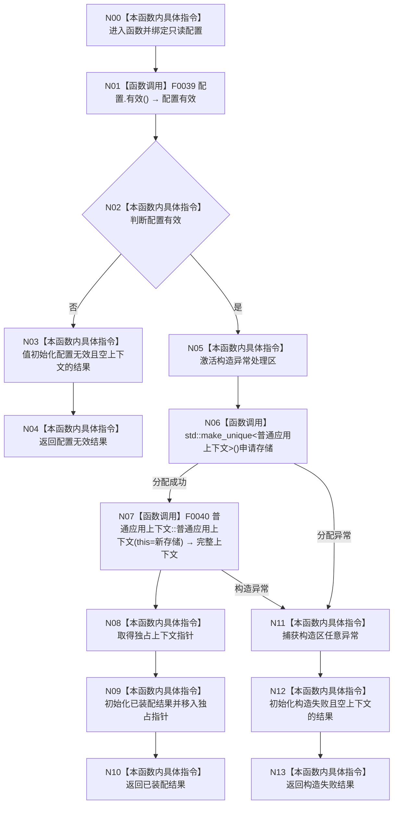

# CF-L3-0001 `构造普通应用上下文` 现状流程图

图类型：现状流程图
代码版本：`a48a70b2d678dea64dd8228adb4f26f0badd9506`
覆盖文件：`海中鱼巣/装配.普通应用.ixx:128-137`
唯一根函数：F0013
完整签名：`海中鱼巣::普通应用装配结果 海中鱼巣::构造普通应用上下文(const 海中鱼巣::普通应用配置& 配置)`
参数：`配置` 为只读借用
返回结果：配置无效、已装配且独占上下文、或构造失败且空上下文
调用图：`流程图/代码流程图/00_调用知识图谱.md`
逐行映射表：`流程图/代码流程图/L3/CF-L3-0001_构造普通应用上下文_逐行代码映射表.md`
输入契约 / 调用语境表：F0007/F0010 调用；成功结果的 `unique_ptr` 唯一拥有上下文
非成功返回二分审查表：配置无效是逻辑内返回；有效配置后的分配/构造异常需追根因
偏差清单：`流程图/代码流程图/00_规范偏差审计.md`
依据提交 / 结构化消息：Git 提交 `a48a70b2d678dea64dd8228adb4f26f0badd9506`
验证输出：配对图、异常边和逐行覆盖由本目录机械校验
不得作为施工许可：是
不得宣称：装配成功等于系统初始化完成

## 函数与节点确认

| 节点组 | 类型 | 当前行为 |
| --- | --- | --- |
| N00-N04 | 指令 / 函数调用 | 调用 F0039；无效配置零结构返回 |
| N05-N08 | 指令 / 函数调用 | 在 try 区内经标准库分配并调用项目构造 F0040 |
| N09-N10 | 本函数内具体指令 | 移动唯一所有权并发布已装配结果 |
| N11-N13 | 本函数内具体指令 | 捕获分配或成员构造异常，RAII 清理后返回构造失败 |

项目源码出边：2。外部边界：`std::make_unique<普通应用上下文>()`。未解析调用：0。

## 当前规范审计

与 `8120` 第 5 节一致：本函数只验证配置、独占构造并发布完整上下文，不执行系统初始化或业务写入。旧施工图把成员构造压入装配函数的归属方式不作为当前事实沿用。
