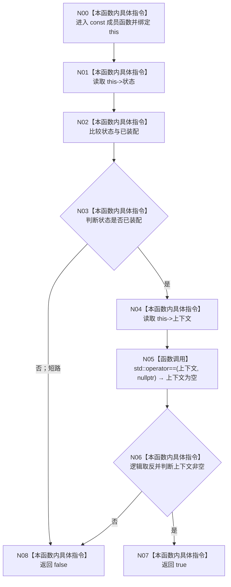

# CF-L3-0002 `普通应用装配结果::成功` 现状流程图

图类型：现状流程图
代码版本：`a48a70b2d678dea64dd8228adb4f26f0badd9506`
覆盖文件：`海中鱼巣/装配.普通应用.ixx:123-125`
唯一根函数：F0014
完整签名：`bool 海中鱼巣::普通应用装配结果::成功() const noexcept`
参数：显式参数无；隐式 `this:const 普通应用装配结果*`
返回结果：状态已装配且上下文非空时为 true
调用图：`流程图/代码流程图/00_调用知识图谱.md`
逐行映射表：`流程图/代码流程图/L3/CF-L3-0002_普通应用装配结果_成功_逐行代码映射表.md`
非成功返回二分审查表：false 是只读查询结果
不得作为施工许可：是

项目源码出边：0。外部边界：C++20 `unique_ptr` 与空指针比较。未解析调用：0。与 `8120` 第 5 节唯一所有权边界一致，无偏差。
