# CF-L3-0003 `初始化普通系统` 现状流程图

图类型：现状流程图
代码版本：`a48a70b2d678dea64dd8228adb4f26f0badd9506`
覆盖文件：`海中鱼巣/领域/初始化.系统.ixx:75-121`
唯一根函数：F0015
完整签名：`海中鱼巣::系统初始化结果 海中鱼巣::初始化普通系统(const 海中鱼巣::系统初始化端口& 端口, const 海中鱼巣::系统初始化请求& 请求)`
参数：六回调端口与初始化请求均为只读借用
返回结果：逐阶段结构化结果；仅全部完成后状态为已初始化
调用图：`流程图/代码流程图/00_调用知识图谱.md`
逐行映射表：`流程图/代码流程图/L3/CF-L3-0003_初始化普通系统_逐行代码映射表.md`
输入契约 / 调用语境表：F0007/F0010 绑定正常生产目标；F0032 可绑定失败注入替身
非成功返回二分审查表：请求/端口无效为逻辑内返回；生产语境阶段失败需追根因，自检注入语境为预期结果
偏差清单：`流程图/代码流程图/00_规范偏差审计.md`
依据提交 / 结构化消息：Git 提交 `a48a70b2d678dea64dd8228adb4f26f0badd9506`
验证输出：配对图、短路、回调目标和逐行覆盖由本目录机械校验
不得作为施工许可：是

```mermaid
flowchart TD
    N00["N00【本函数内具体指令】进入函数并绑定端口与请求"]
    N01["N01【本函数内具体指令】默认初始化局部结果"]
    N02["N02【函数调用】F0041 请求.有效() → 请求有效"]
    N03{"N03【本函数内具体指令】判断请求有效"}
    N04["N04【本函数内具体指令】写入请求无效状态"]
    N05["N05【本函数内具体指令】返回请求无效结果"]
    N06["N06【函数调用】F0042 端口.完整() → 端口完整"]
    N07{"N07【本函数内具体指令】判断端口完整"}
    N08["N08【本函数内具体指令】写入端口无效状态"]
    N09["N09【本函数内具体指令】返回端口无效结果"]
    N10["N10【函数调用】经端口调用F0043 初始化方法登记根(稳定键) → 方法根候选"]
    N11["N11【本函数内具体指令】写入结果.方法登记根"]
    N12["N12【函数调用】optional::has_value(方法登记根) → 有值"]
    N13{"N13【本函数内具体指令】判断方法根有值"}
    N14["N14【本函数内具体指令】写入方法登记根失败状态"]
    N15["N15【本函数内具体指令】返回方法登记根失败"]
    N16["N16【函数调用】经端口调用F0044 自我线程::启动(根需求参数) → 启动候选"]
    N17["N17【本函数内具体指令】保存启动结果"]
    N18{"N18【本函数内具体指令】判断启动.成功"}
    N19{"N19【本函数内具体指令】短路后判断是否复用初始化结果"}
    N20["N20【本函数内具体指令】写入自我线程启动失败状态"]
    N21["N21【本函数内具体指令】返回自我线程启动失败"]
    N22["N22【函数调用】构造std::chrono::seconds(10) → 十秒时限"]
    N23["N23【函数调用】转换为std::chrono::milliseconds"]
    N24["N24【函数调用】经端口调用F0045 等待初始化完成(10000ms) → 已等待"]
    N25["N25【本函数内具体指令】保存等待结果"]
    N26["N26【函数调用】经端口调用F0046 读取初始化快照() → 快照候选"]
    N27["N27【本函数内具体指令】写入结果.自我初始化"]
    N28{"N28【本函数内具体指令】判断已等待完成"}
    N29["N29【函数调用】optional::has_value(自我初始化) → 快照有值"]
    N30{"N30【本函数内具体指令】短路后判断快照有值"}
    N31["N31【函数调用】optional::operator->() → 快照对象"]
    N32["N32【函数调用】F0047 快照.成功() → 快照成功"]
    N33{"N33【本函数内具体指令】短路后判断快照成功"}
    N34["N34【本函数内具体指令】写入自我线程初始化失败状态"]
    N35["N35【本函数内具体指令】返回自我线程初始化失败"]
    N36["N36【函数调用】经端口调用F0048 初始化四个根() → 概念图候选"]
    N37["N37【本函数内具体指令】写入结果.概念图"]
    N38["N38【函数调用】F0049 概念图.成功() → 概念图成功"]
    N39{"N39【本函数内具体指令】判断概念图成功"}
    N40["N40【本函数内具体指令】写入概念图初始化失败状态"]
    N41["N41【本函数内具体指令】返回概念图初始化失败"]
    N42["N42【函数调用】optional::operator->() → 快照对象"]
    N43["N43【本函数内具体指令】读取自我存在节点"]
    N44["N44【函数调用】经端口调用F0050 确保存在实例根支持(节点) → 支持候选"]
    N45["N45【本函数内具体指令】写入结果.自我存在根支持"]
    N46["N46【函数调用】optional::has_value(支持) → 支持有值"]
    N47{"N47【本函数内具体指令】判断支持有值"}
    N48["N48【函数调用】optional::value(支持) → 支持根"]
    N49["N49【函数调用】F0051 节点句柄operator==(支持根, 存在根) → 根相等"]
    N50{"N50【本函数内具体指令】判断根相等"}
    N51["N51【本函数内具体指令】写入存在根支持失败状态"]
    N52["N52【本函数内具体指令】返回存在根支持失败"]
    N53["N53【本函数内具体指令】写入已初始化状态"]
    N54["N54【本函数内具体指令】返回完整初始化结果"]
    N00 --> N01 --> N02 --> N03
    N03 -- "否" --> N04 --> N05
    N03 -- "是" --> N06 --> N07
    N07 -- "否" --> N08 --> N09
    N07 -- "是" --> N10 --> N11 --> N12 --> N13
    N13 -- "否" --> N14 --> N15
    N13 -- "是" --> N16 --> N17 --> N18
    N18 -- "否" --> N20 --> N21
    N18 -- "是" --> N19
    N19 -- "是；复用" --> N20
    N19 -- "否" --> N22 --> N23 --> N24 --> N25 --> N26 --> N27 --> N28
    N28 -- "否" --> N34
    N28 -- "是" --> N29 --> N30
    N30 -- "否" --> N34
    N30 -- "是" --> N31 --> N32 --> N33
    N33 -- "否" --> N34 --> N35
    N33 -- "是" --> N36 --> N37 --> N38 --> N39
    N39 -- "否" --> N40 --> N41
    N39 -- "是" --> N42 --> N43 --> N44 --> N45 --> N46 --> N47
    N47 -- "否" --> N51
    N47 -- "是" --> N48 --> N49 --> N50
    N50 -- "否" --> N51 --> N52
    N50 -- "是" --> N53 --> N54
```

## 函数与节点确认

请求、端口、六个阶段及最终发布均在图中逐项可见。F0043—F0046、F0048、F0050 是正常生产绑定下的项目回调目标；实际静态调用表达式是六个 `std::function::operator()` 外部边界，覆盖端口/失败注入语境不得冒充无条件直达正常目标。

项目源码出边：11。外部边界包括 6 次 `std::function::operator()`、optional 操作和 chrono 构造/转换。未解析调用：0。

## 当前规范审计

与 `8120` 第 5 节一致：方法根→唯一自我线程→等待和快照→概念四根→自我存在根支持→完整结果；没有夹带重复启动、错误输入、删除、数据库或 UI 验收。
