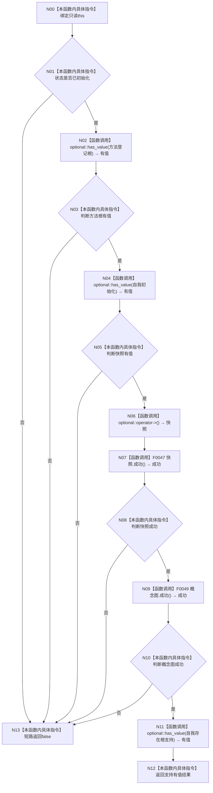

# CF-L3-0004 `系统初始化结果::成功` 现状流程图

图类型：现状流程图
代码版本：`a48a70b2d678dea64dd8228adb4f26f0badd9506`
覆盖文件：`海中鱼巣/领域/初始化.系统.ixx:65-72`
唯一根函数：F0016
完整签名：`bool 海中鱼巣::系统初始化结果::成功() const noexcept`
参数：显式参数无；隐式 `this:const 系统初始化结果*`
返回结果：状态和五个必需结果按短路顺序全部完整时为 true
调用图：`流程图/代码流程图/00_调用知识图谱.md`
逐行映射表：`流程图/代码流程图/L3/CF-L3-0004_系统初始化结果_成功_逐行代码映射表.md`
不得作为施工许可：是

项目源码出边：2（复用 F0047、F0049）。外部边界：optional `has_value/operator->`。未解析调用：0。与 `8120` 完整结果查询合同一致，无偏差。
