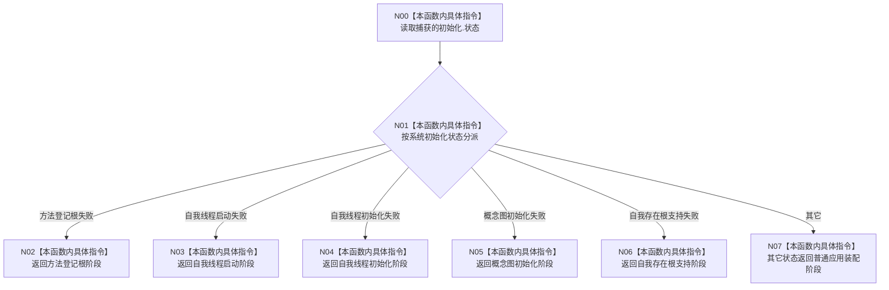

# CF-L3-0005 普通程序失败阶段映射 lambda 现状流程图

图类型：现状流程图
代码版本：`a48a70b2d678dea64dd8228adb4f26f0badd9506`
覆盖文件：`海中鱼巣/启动.应用程序.ixx:67-76`；函数正文 `68-74`
唯一根函数：F0017
完整签名：`海中鱼巣::程序失败阶段 海中鱼巣::运行普通程序(海中鱼巣::启动模式)::<lambda@启动.应用程序.ixx:67>::operator()() const`
参数：显式无；隐式闭包 `this` 按引用捕获 `初始化`
返回结果：按系统初始化状态映射程序失败阶段
调用图：`流程图/代码流程图/00_调用知识图谱.md`
逐行映射表：`流程图/代码流程图/L3/CF-L3-0005_普通程序失败阶段映射lambda_逐行代码映射表.md`
不得作为施工许可：是

项目源码出边：0。外部边界：0。未解析调用：0。

规范审计：五个生产初始化阶段均具名映射；default 同时承接请求/端口无效、内部不一致和不完整已初始化等残余状态，当前 `8120` 未冻结更细失败阶段，登记为语义粒度风险而非已确认规范冲突。
