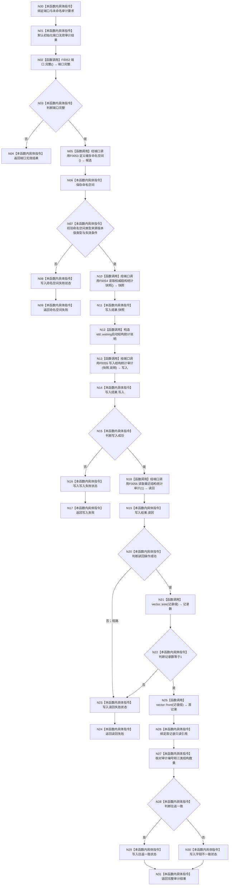

# CF-L3-0006 `执行启动结构审计` 现状流程图

图类型：现状流程图
代码版本：`a48a70b2d678dea64dd8228adb4f26f0badd9506`
覆盖文件：`海中鱼巣/适配/审计.数据库启动.ixx:55-93`
唯一根函数：F0018
完整签名：`海中鱼巣::数据库启动审计结果 海中鱼巣::执行启动结构审计(const 海中鱼巣::数据库启动审计端口& 端口, 海中鱼巣::数据库审计要求 要求)`
参数：端口只读借用；源码未读取 `要求`
返回结果：端口、命名空间、写入、读回或往返一致状态及证据
调用图：`流程图/代码流程图/00_调用知识图谱.md`
逐行映射表：`流程图/代码流程图/L3/CF-L3-0006_执行启动结构审计_逐行代码映射表.md`
不得作为施工许可：是

正常生产端口下，四次 `std::function::operator()` 分别解析到 F0053—F0056；覆盖端口/自检替身不冒充无条件直达正常目标。项目源码出边：5。外部边界：4 次端口调用、wstring 构造、vector `size/front`。未解析调用：0。

## 当前规范审计

SQL 仅作非权威审计投影，与 `8120` 第 7 节一致。偏差候选：参数 `数据库审计要求` 未使用；`快照失败` 状态当前不可达；命名空间校验未检查 `可持久化` 且未限定失效条件为权威结构变化，可能把快照/命名空间错误延迟并误分类为写入失败。
