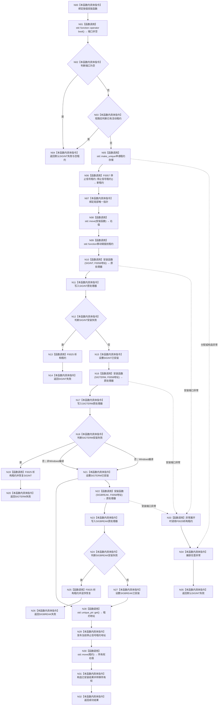

# CF-L3-0007 `安装程序停止信号` 现状流程图

图类型：现状流程图
代码版本：`a48a70b2d678dea64dd8228adb4f26f0badd9506`
覆盖文件：`海中鱼巣/启动.程序运行宿主.ixx:110-140`
唯一根函数：F0019
完整签名：`海中鱼巣::停止信号安装结果 海中鱼巣::安装程序停止信号(海中鱼巣::程序信号安装函数 安装函数 = 程序信号安装函数{&std::signal}) noexcept`
参数：按值取得可调用安装端口；默认目标为外部 `std::signal`
返回结果：全部平台所需信号安装成功时发布并返回唯一租约，否则返回具名失败与空租约
调用图：`流程图/代码流程图/00_调用知识图谱.md`
逐行映射表：`流程图/代码流程图/L3/CF-L3-0007_安装程序停止信号_逐行代码映射表.md`
不得作为施工许可：是

F0058 只注册地址，安装期间不直接执行；成功后由 CRT/操作系统信号边界异步回调。项目源码关系：F0057 构造、F0025 析构、F0058 回调注册。外部边界：`std::function`、`make_unique`、`move`、`unique_ptr::get`、默认 `std::signal`。未解析调用：0；自检注入目标待 F0032 按实际调用点登记。

## 当前规范审计

与 `8120` 程序宿主边界一致：所有信号成功后才发布裸地址，失败靠租约逆序恢复。风险候选：静态裸指针的异步信号安全性，以及恢复端口若在析构/异常展开中抛出会导致终止；现行规范未进一步裁决。
