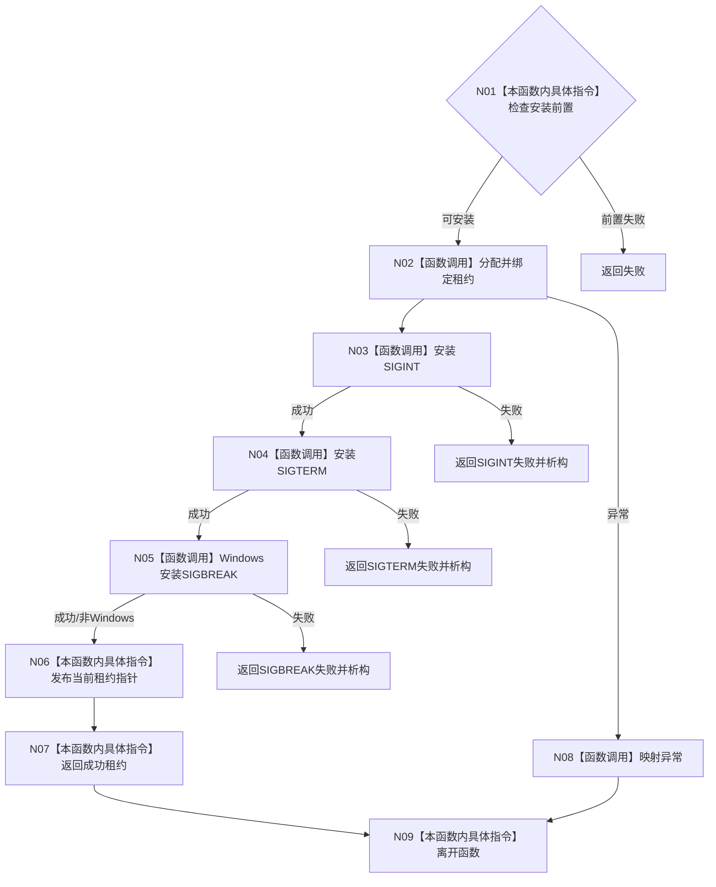

# CF-L3-0007_安装程序停止信号 `signal}) noexcept` 现状流程图

图类型：现状流程图
代码版本：`720f4afd78e63d95d244867aa13d72970a419654`
覆盖文件：`海中鱼巣/启动.程序运行宿主.ixx:99-129`
唯一根函数：F0019
完整签名：`海中鱼巣::停止信号安装结果 海中鱼巣::安装程序停止信号(海中鱼巣::程序信号安装函数 安装函数 = 海中鱼巣::程序信号安装函数{&std::signal}) noexcept`
参数：安装函数：std::function，可替换信号安装端口
返回结果：停止信号安装结果
调用图：`流程图/代码流程图/00_调用知识图谱.md`
逐行映射表：`流程图/代码流程图/L3/CF-L3-0007_安装程序停止信号_逐行代码映射表.md`
输入契约 / 调用语境表：本图“输入与非成功边界”
非成功返回二分审查表：本图“输入与非成功边界”
偏差清单：`流程图/代码流程图/00_规范偏差审计.md`
依据提交 / 结构化消息：`720f4afd78e63d95d244867aa13d72970a419654`；GRAPH-MAINTENANCE-RESUME
验证输出：逐源码静态复核；未运行构建、程序或业务自检
不得作为施工许可：是
不得宣称：不得据此宣称业务能力、规范符合、构建或运行完成

## 输入与非成功边界

- 输入只来自当前 `main` 可达调用方和所列参数；未列调用语境不据此扩展。
- 表中标为逻辑内返回的分支发生于权威结构写入前；标为追根因解决的分支不得被升级为正常成功。
- 本图只描述当前实现，不裁决目标设计。

## 直接调用

项目被调：F0057, F0058, F0025。外部边界读取聚合外部边界表。
