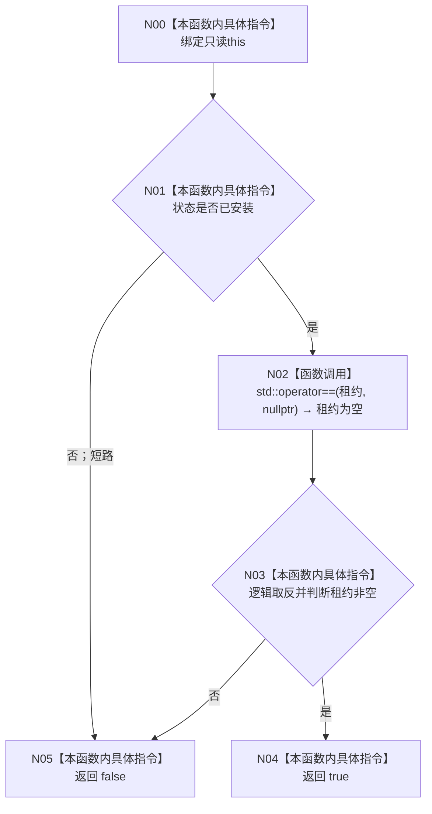

# CF-L3-0008 `停止信号安装结果::成功` 现状流程图

图类型：现状流程图
代码版本：`a48a70b2d678dea64dd8228adb4f26f0badd9506`
覆盖文件：`海中鱼巣/启动.程序运行宿主.ixx:91-93`
唯一根函数：F0020
完整签名：`bool 海中鱼巣::停止信号安装结果::成功() const noexcept`
参数：显式无；隐式 `this:const 停止信号安装结果*`
返回结果：状态已安装且租约非空时为 true
调用图：`流程图/代码流程图/00_调用知识图谱.md`
逐行映射表：`流程图/代码流程图/L3/CF-L3-0008_停止信号安装结果_成功_逐行代码映射表.md`
不得作为施工许可：是

项目源码出边：0。外部边界：C++20 `unique_ptr` 与空指针比较。未解析调用：0。与 `8120` 信号租约结构化成功合同一致。
