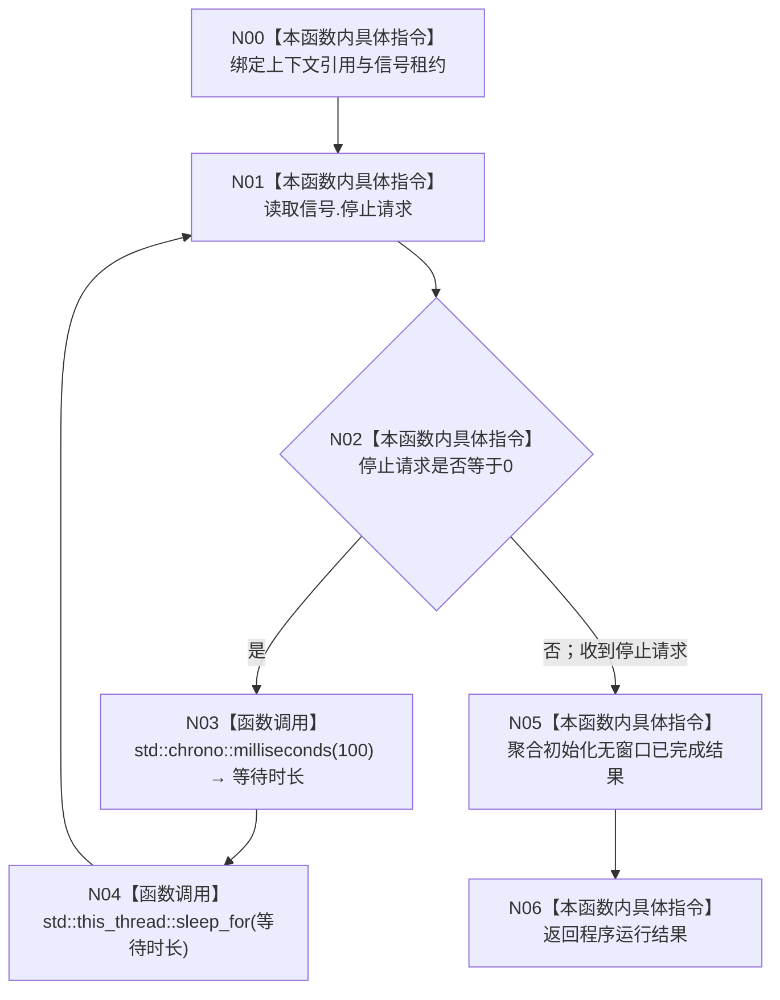

# CF-L3-0009 `运行无窗口宿主` 现状流程图

图类型：现状流程图
代码版本：`a48a70b2d678dea64dd8228adb4f26f0badd9506`
覆盖文件：`海中鱼巣/启动.程序运行宿主.ixx:174-182`
唯一根函数：F0021
完整签名：`海中鱼巣::程序运行结果 海中鱼巣::运行无窗口宿主(海中鱼巣::普通应用上下文&, 海中鱼巣::停止信号租约& 信号)`
参数：上下文为未命名非拥有引用并保持生命周期；信号为非拥有引用
返回结果：观察到停止请求后返回无窗口常驻已完成
调用图：`流程图/代码流程图/00_调用知识图谱.md`
逐行映射表：`流程图/代码流程图/L3/CF-L3-0009_运行无窗口宿主_逐行代码映射表.md`
不得作为施工许可：是

项目源码出边：0。外部边界：chrono 时长构造和 `sleep_for`。未解析调用：0。与 `8120` 无窗口宿主边界一致，无偏差。
