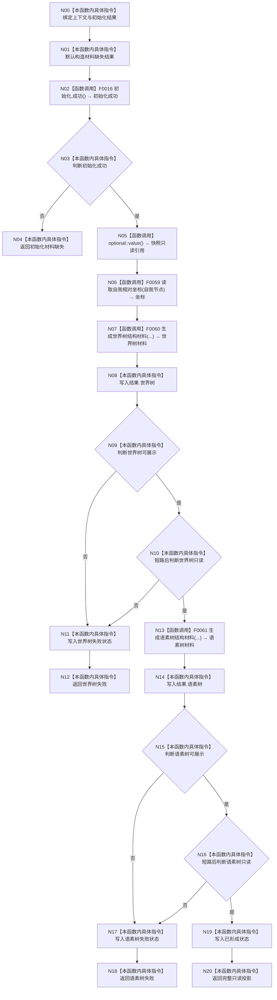

# CF-L3-0010 `生成控制面板启动投影` 现状流程图

图类型：现状流程图
代码版本：`a48a70b2d678dea64dd8228adb4f26f0badd9506`
覆盖文件：`海中鱼巣/界面/投影.控制面板启动.ixx:258-281`
唯一根函数：F0022
完整签名：`海中鱼巣::控制面板启动投影结果 海中鱼巣::生成控制面板启动投影(const 海中鱼巣::普通应用上下文& 上下文, const 海中鱼巣::系统初始化结果& 初始化)`
参数：上下文和初始化结果均为只读借用
返回结果：初始化材料缺失、世界树/语素树失败或完整只读投影
调用图：`流程图/代码流程图/00_调用知识图谱.md`
逐行映射表：`流程图/代码流程图/L3/CF-L3-0010_生成控制面板启动投影_逐行代码映射表.md`
不得作为施工许可：是

项目源码出边：4（含复用 F0016）。外部边界：optional `value()`。未解析调用：0。

规范审计：投影只读且不写业务事实。偏差 `ENTRY-F09-CURRENT-01`：F0059 返回坐标为空时当前代码仍调用 F0060；生成器可省略坐标文本并使投影成功，而现行施工设计要求空坐标返回世界树投影失败。
