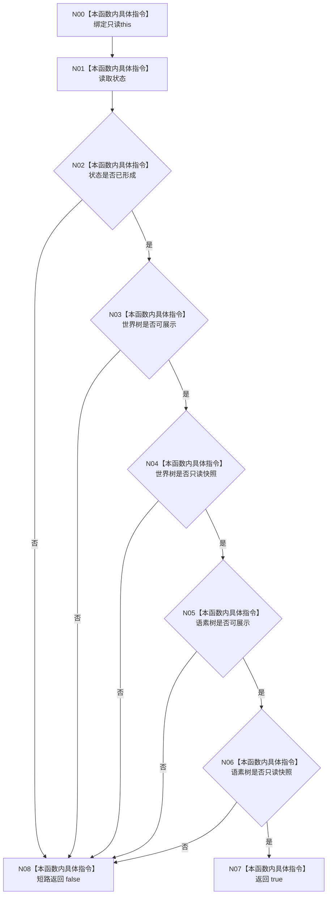

# CF-L3-0011 `控制面板启动投影结果::成功` 现状流程图

图类型：现状流程图
代码版本：`a48a70b2d678dea64dd8228adb4f26f0badd9506`
覆盖文件：`海中鱼巣/界面/投影.控制面板启动.ixx:251-255`
唯一根函数：F0023
完整签名：`bool 海中鱼巣::控制面板启动投影结果::成功() const noexcept`
参数：显式无；隐式只读 `this`
返回结果：状态已形成且两棵树都可展示、只读时为 true
调用图：`流程图/代码流程图/00_调用知识图谱.md`
逐行映射表：`流程图/代码流程图/L3/CF-L3-0011_控制面板启动投影结果_成功_逐行代码映射表.md`
不得作为施工许可：是

项目源码出边、外部边界、未解析调用均为0。与 `8120` 只读控制面板投影合同一致，无偏差。
