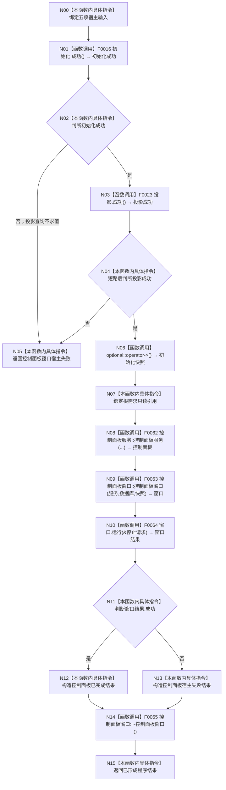

# CF-L3-0012 `运行控制面板宿主` 现状流程图

图类型：现状流程图
代码版本：`a48a70b2d678dea64dd8228adb4f26f0badd9506`
覆盖文件：`海中鱼巣/启动.程序运行宿主.ixx:142-172`
唯一根函数：F0024
完整签名：`海中鱼巣::程序运行结果 海中鱼巣::运行控制面板宿主(海中鱼巣::普通应用上下文& 上下文, const 海中鱼巣::系统初始化结果& 初始化, const 海中鱼巣::控制面板启动投影结果& 投影, const 海中鱼巣::数据库启动审计结果& 审计, 海中鱼巣::停止信号租约& 信号)`
参数：上下文/信号为非拥有引用，其余为只读借用
返回结果：窗口正常成功或宿主失败
调用图：`流程图/代码流程图/00_调用知识图谱.md`
逐行映射表：`流程图/代码流程图/L3/CF-L3-0012_运行控制面板宿主_逐行代码映射表.md`
不得作为施工许可：是

项目源码出边：6（含复用 F0016/F0023 与隐式 F0065 析构）。外部边界：optional `operator->`、返回对象中的空 optional。未解析调用：0。

规范审计：控制面板服务只消费只读投影和既有仓库/服务引用，窗口运行接收停止请求；日志与数据库审计结果不裁决核心初始化。无现行 8120 偏差。
