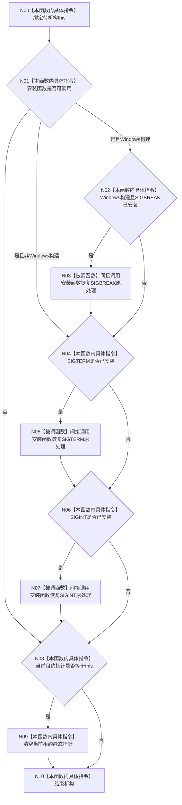

# CF-L3-0013 `停止信号租约::~停止信号租约` 现状流程图

图类型：现状流程图
代码版本：`a48a70b2d678dea64dd8228adb4f26f0badd9506`
覆盖文件：`海中鱼巣/启动.程序运行宿主.ixx:45-62`
唯一根函数：F0025
完整签名：`海中鱼巣::停止信号租约::~停止信号租约()`
参数：显式无；隐式可写 `this`
返回结果：无；按已安装标志恢复原信号处理器，并在自身仍为当前租约时清空静态指针
调用图：`流程图/代码流程图/00_调用知识图谱.md`
逐行映射表：`流程图/代码流程图/L3/CF-L3-0013_停止信号租约_析构_逐行代码映射表.md`
不得作为施工许可：是

三处间接调用按实例来源解析为外部 `std::signal` 或项目 lambda F0067；未解析调用为 0。析构隐式 `noexcept(true)`，注入回调若抛出会终止进程，登记为风险而非已确认规范偏差。
