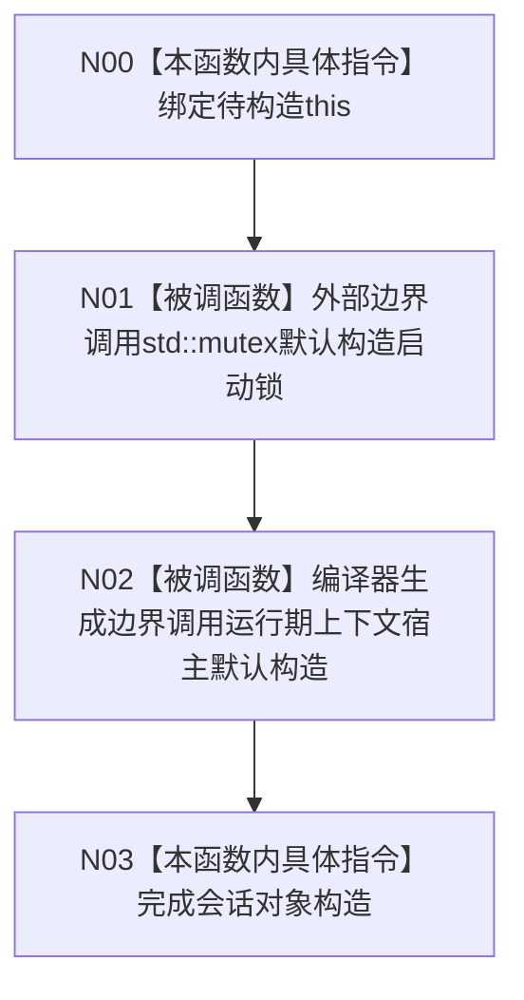

# CF-L3-0014 `生产运行期会话::生产运行期会话` 现状流程图

图类型：现状流程图
代码版本：`a48a70b2d678dea64dd8228adb4f26f0badd9506`
覆盖文件：`海中鱼巣/启动.生产运行期.ixx:46,130-131`
唯一根函数：F0026
完整签名：`海中鱼巣::生产运行期会话::生产运行期会话()`
参数：显式无；隐式可写 `this`
返回结果：无 C++ 返回值；完成一个默认初始化的 `生产运行期会话` 对象
调用图：`流程图/代码流程图/00_调用知识图谱.md`
逐行映射表：`流程图/代码流程图/L3/CF-L3-0014_生产运行期会话_构造_逐行代码映射表.md`
不得作为施工许可：是

项目源码出边为 0。外部/编译器边界为 X0007、X0008；未解析调用为 0。
