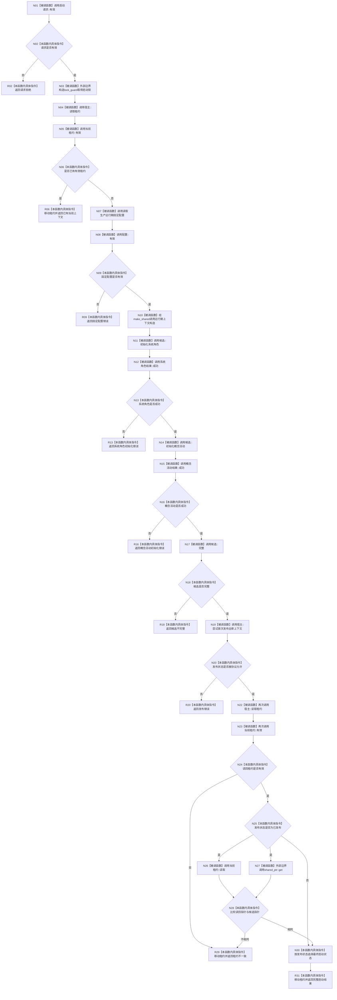

# CF-L3-0015 `生产运行期会话::启动` 现状流程图

图类型：现状流程图
代码版本：`a48a70b2d678dea64dd8228adb4f26f0badd9506`
覆盖文件：`海中鱼巣/启动.生产运行期.ixx:50-123`
唯一根函数：F0027
完整签名：`海中鱼巣::生产运行期启动结果 海中鱼巣::生产运行期会话::启动(const 海中鱼巣::生产运行期启动请求& 请求)`
参数：只读启动请求；隐式可写 `this`
返回结果：结构化启动状态、系统角色状态、概念活动状态、发布状态和运行期上下文租约
调用图：`流程图/代码流程图/00_调用知识图谱.md`
逐行映射表：`流程图/代码流程图/L3/CF-L3-0015_生产运行期会话_启动_逐行代码映射表.md`
不得作为施工许可：是

N26 与 N27 是内建 `!=` 的两个操作数，C++ 不固定二者相对求值顺序；图以并列前驱表达，不声称固定先后。所有取得启动锁后的返回路径均经标准库析构释放锁。项目源码唯一出边 13 个，未解析调用 0。
