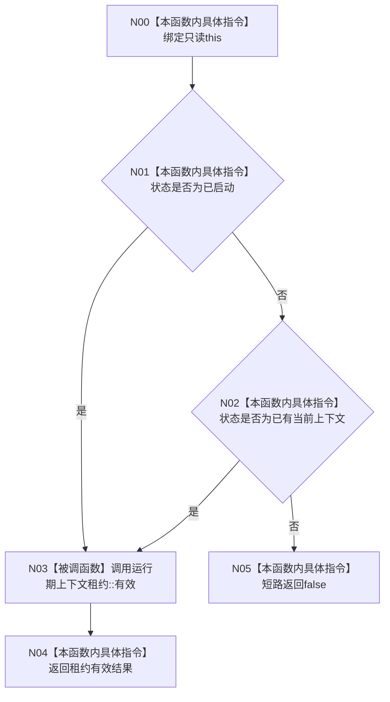

# CF-L3-0016 `生产运行期启动结果::成功` 现状流程图

图类型：现状流程图
代码版本：`a48a70b2d678dea64dd8228adb4f26f0badd9506`
覆盖文件：`海中鱼巣/启动.生产运行期.ixx:37-41`
唯一根函数：F0028
完整签名：`bool 海中鱼巣::生产运行期启动结果::成功() const`
参数：显式无；隐式只读 `this`
返回结果：状态为“已启动”或“已有当前上下文”，且租约有效时返回 `true`；否则返回 `false`
调用图：`流程图/代码流程图/00_调用知识图谱.md`
逐行映射表：`流程图/代码流程图/L3/CF-L3-0016_生产运行期启动结果_成功_逐行代码映射表.md`
不得作为施工许可：是

项目源码出边：F0028 → F0066。外部边界、未解析调用均为 0。
