# CF-L3-0017 `登记入口初始化自检单元` 现状流程图

图类型：现状流程图
代码版本：`0a93526882cb33c61c2fbb04ecad1aeaddcfe225`
覆盖文件：`海中鱼巣/自检.入口初始化.ixx:655-688`
唯一根函数：F0029
完整签名：`bool 海中鱼巣::登记入口初始化自检单元(海中鱼巣::自检运行器& 运行器, const 海中鱼巣::入口初始化自检运行配置& 配置)`
参数：可写运行器；只读配置（复制进入每个回调闭包）
返回结果：15 次登记的严格左到右短路逻辑与；任一登记失败即返回 `false`，不回滚已经成功的前项
调用图：`流程图/代码流程图/00_调用知识图谱.md`
逐行映射表：`流程图/代码流程图/L3/CF-L3-0017_登记入口初始化自检单元_逐行代码映射表.md`
不得作为施工许可：是

```mermaid
flowchart TD
    P01["P01【本函数内具体指令】按值构造S01回调闭包"]
    C01["C01【被调函数】调用登记自检登记S01"]
    D01{"D01【本函数内具体指令】S01登记是否成功"}
    P02["P02【本函数内具体指令】按值构造S02回调闭包"]
    C02["C02【被调函数】调用登记自检登记S02"]
    D02{"D02【本函数内具体指令】S02登记是否成功"}
    P03["P03【本函数内具体指令】按值构造S03回调闭包"]
    C03["C03【被调函数】调用登记自检登记S03"]
    D03{"D03【本函数内具体指令】S03登记是否成功"}
    P04["P04【本函数内具体指令】按值构造S04回调闭包"]
    C04["C04【被调函数】调用登记自检登记S04"]
    D04{"D04【本函数内具体指令】S04登记是否成功"}
    P05["P05【本函数内具体指令】按值构造S05回调闭包"]
    C05["C05【被调函数】调用登记自检登记S05"]
    D05{"D05【本函数内具体指令】S05登记是否成功"}
    P06["P06【本函数内具体指令】按值构造S06回调闭包"]
    C06["C06【被调函数】调用登记自检登记S06"]
    D06{"D06【本函数内具体指令】S06登记是否成功"}
    P07["P07【本函数内具体指令】按值构造S07回调闭包"]
    C07["C07【被调函数】调用登记自检登记S07"]
    D07{"D07【本函数内具体指令】S07登记是否成功"}
    P08["P08【本函数内具体指令】按值构造S08回调闭包"]
    C08["C08【被调函数】调用登记自检登记S08"]
    D08{"D08【本函数内具体指令】S08登记是否成功"}
    P09["P09【本函数内具体指令】按值构造S09回调闭包"]
    C09["C09【被调函数】调用登记自检登记S09"]
    D09{"D09【本函数内具体指令】S09登记是否成功"}
    P10["P10【本函数内具体指令】按值构造S10回调闭包"]
    C10["C10【被调函数】调用登记自检登记S10"]
    D10{"D10【本函数内具体指令】S10登记是否成功"}
    P11["P11【本函数内具体指令】按值构造S11回调闭包"]
    C11["C11【被调函数】调用登记自检登记S11"]
    D11{"D11【本函数内具体指令】S11登记是否成功"}
    P12["P12【本函数内具体指令】按值构造S12回调闭包"]
    C12["C12【被调函数】调用登记自检登记S12"]
    D12{"D12【本函数内具体指令】S12登记是否成功"}
    P13["P13【本函数内具体指令】按值构造S13回调闭包"]
    C13["C13【被调函数】调用登记自检登记S13"]
    D13{"D13【本函数内具体指令】S13登记是否成功"}
    P14["P14【本函数内具体指令】按值构造S14回调闭包"]
    C14["C14【被调函数】调用登记自检登记S14"]
    D14{"D14【本函数内具体指令】S14登记是否成功"}
    P15["P15【本函数内具体指令】按值构造S15回调闭包 R0858"]
    C15["C15【被调函数】调用登记自检登记S15"]
    R15["R15【本函数内具体指令】返回S15登记结果"]
    R00["R00【本函数内具体指令】短路返回false且不登记后续项"]
    P01 --> C01 --> D01
    D01 -- "否" --> R00
    D01 -- "是" --> P02 --> C02 --> D02
    D02 -- "否" --> R00
    D02 -- "是" --> P03 --> C03 --> D03
    D03 -- "否" --> R00
    D03 -- "是" --> P04 --> C04 --> D04
    D04 -- "否" --> R00
    D04 -- "是" --> P05 --> C05 --> D05
    D05 -- "否" --> R00
    D05 -- "是" --> P06 --> C06 --> D06
    D06 -- "否" --> R00
    D06 -- "是" --> P07 --> C07 --> D07
    D07 -- "否" --> R00
    D07 -- "是" --> P08 --> C08 --> D08
    D08 -- "否" --> R00
    D08 -- "是" --> P09 --> C09 --> D09
    D09 -- "否" --> R00
    D09 -- "是" --> P10 --> C10 --> D10
    D10 -- "否" --> R00
    D10 -- "是" --> P11 --> C11 --> D11
    D11 -- "否" --> R00
    D11 -- "是" --> P12 --> C12 --> D12
    D12 -- "否" --> R00
    D12 -- "是" --> P13 --> C13 --> D13
    D13 -- "否" --> R00
    D13 -- "是" --> P14 --> C14 --> D14
    D14 -- "否" --> R00
    D14 -- "是" --> P15 --> C15 --> R15
```

15 个登记调用均以独立节点和独立短路边表达。15 个回调 lambda 均为后续确实调用的非平凡项目实体：S01—S14 为 F0080—F0093，S15 为 R0858；它们由 F0031 经已登记回调槽同步调用。R0858 再直接调用 S15 根函数 R0847。
