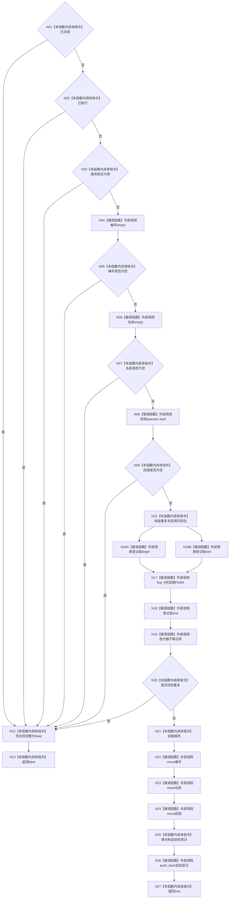

# CF-L3-0018 `自检运行器::登记自检` 现状流程图

图类型：现状流程图
代码版本：`a48a70b2d678dea64dd8228adb4f26f0badd9506`
覆盖文件：`海中鱼巣/自检.运行器.ixx:41-59`
唯一根函数：F0030
完整签名：`bool 海中鱼巣::自检运行器::登记自检(std::uint32_t 顺序, std::string 编号, std::string 名称, 海中鱼巣::自检执行回调 回调)`
参数：按值接收顺序、编号、名称和回调；成功时移动进登记组
返回结果：合法且不重复并成功追加时返回 `true`；入口非法或重复时永久写坏合同并返回 `false`；标准库异常向外传播
调用图：`流程图/代码流程图/00_调用知识图谱.md`
逐行映射表：`流程图/代码流程图/L3/CF-L3-0018_自检运行器_登记自检_逐行代码映射表.md`
不得作为施工许可：是

`begin()`、`end()` 与闭包实参的相对求值次序不额外冻结。F0094 是 `find_if` 实际同步调用且含短路判断的项目 lambda，已单独入队。
