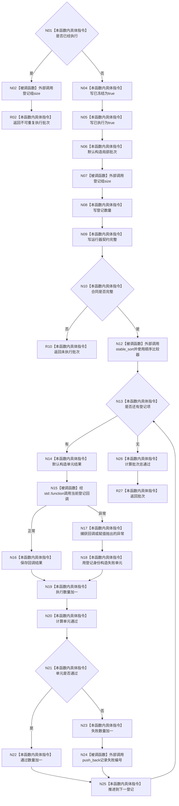

# CF-L3-0019 `自检运行器::运行全部` 现状流程图

图类型：现状流程图
代码版本：`a48a70b2d678dea64dd8228adb4f26f0badd9506`
覆盖文件：`海中鱼巣/自检.运行器.ixx:61-99`
唯一根函数：F0031
完整签名：`海中鱼巣::自检批次结果 海中鱼巣::自检运行器::运行全部()`
参数：显式无；隐式可写 `this`
返回结果：登记、执行、通过、失败计数，失败编号组，合同完整性和总通过状态
调用图：`流程图/代码流程图/00_调用知识图谱.md`
逐行映射表：`流程图/代码流程图/L3/CF-L3-0019_自检运行器_运行全部_逐行代码映射表.md`
不得作为施工许可：是

动态回调目标已由所有实际登记语境闭合为 F0032、F0033 和 F0080—F0093；F0033 再调用本函数形成回边，只记录不重复生成。排序比较器只返回顺序小于关系，是平凡标准算法适配器，登记在边界调用中而不另制图。
