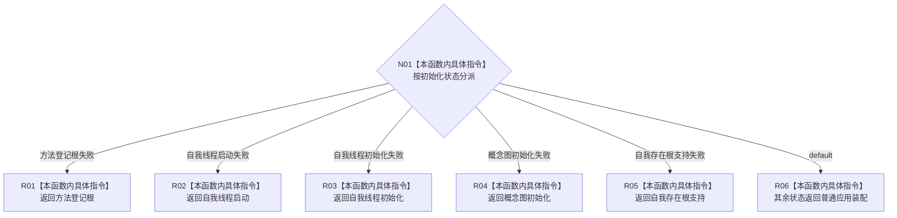

# CF-L3-0020 数据库专项失败阶段映射 lambda 现状流程图

图类型：现状流程图
代码版本：`a48a70b2d678dea64dd8228adb4f26f0badd9506`
覆盖文件：`海中鱼巣/启动.应用程序.ixx:131-140`
唯一根函数：F0034
完整签名：`海中鱼巣::程序失败阶段 海中鱼巣::运行数据库专项(const 海中鱼巣::数据库启动审计端口*)::<lambda@启动.应用程序.ixx:131>::operator()() const`
参数：显式无；按引用捕获外层 `初始化`
返回结果：把系统初始化状态映射为程序失败阶段
调用图：`流程图/代码流程图/00_调用知识图谱.md`
逐行映射表：`流程图/代码流程图/L3/CF-L3-0020_数据库专项失败阶段映射lambda_逐行代码映射表.md`
不得作为施工许可：是

项目源码调用、外部边界、未解析调用均为 0。默认分支折叠多种失败原因，登记为语义粒度风险。
