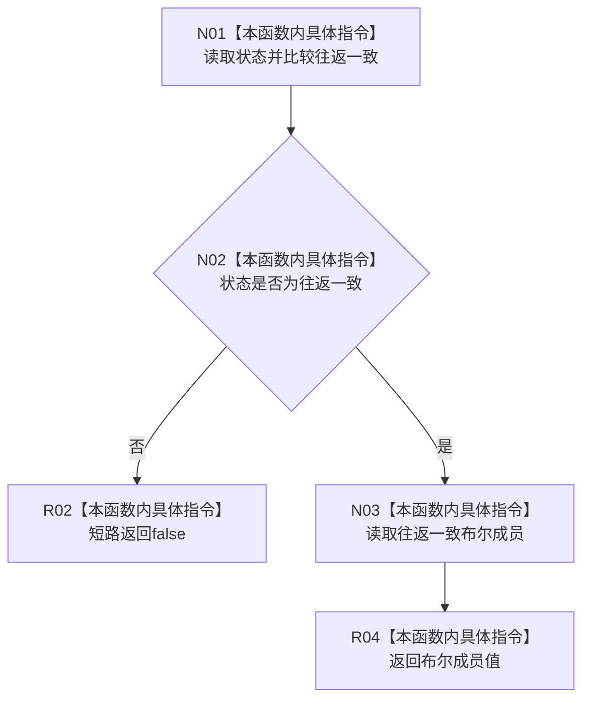

# CF-L3-0021 `数据库启动审计结果::成功` 现状流程图

图类型：现状流程图
代码版本：`a48a70b2d678dea64dd8228adb4f26f0badd9506`
覆盖文件：`海中鱼巣/适配/审计.数据库启动.ixx:50-52`
唯一根函数：F0035
完整签名：`bool 海中鱼巣::数据库启动审计结果::成功() const noexcept`
参数：显式无；隐式只读 `this`
返回结果：状态为往返一致且同名布尔成员为 `true` 时返回 `true`
调用图：`流程图/代码流程图/00_调用知识图谱.md`
逐行映射表：`流程图/代码流程图/L3/CF-L3-0021_数据库启动审计结果_成功_逐行代码映射表.md`
不得作为施工许可：是

项目源码调用、外部边界和未解析调用均为 0。
