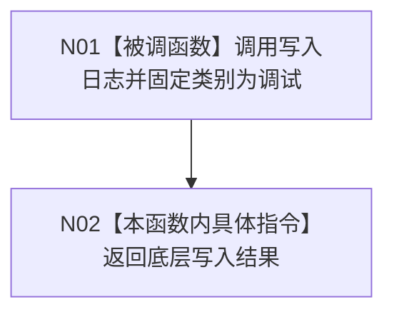

# CF-L3-0022 `记录调试日志` 现状流程图

图类型：现状流程图
代码版本：`a48a70b2d678dea64dd8228adb4f26f0badd9506`
覆盖文件：`海中鱼巣/核心/日志系统.h:298-300`
唯一根函数：F0036
完整签名：`bool 海中鱼巣::记录调试日志(std::wstring_view 调试切片名, std::wstring_view 模块, std::wstring_view 入口, std::wstring_view 内容)`
参数：四个只读借用字符串视图，仅在调用期间有效
返回结果：原样返回底层人读日志写入结果；不得作为机器事实或验收裁决
调用图：`流程图/代码流程图/00_调用知识图谱.md`
逐行映射表：`流程图/代码流程图/L3/CF-L3-0022_记录调试日志_逐行代码映射表.md`
不得作为施工许可：是

唯一项目源码出边为 F0095。F0036 本身没有预编译门禁；具名调用宏关闭时不会调用本函数，且不求值仅供日志的参数。
