# CF-L3-0023 `运行关系仓库性能基线自检` 现状流程图

图类型：现状流程图
代码版本：`a48a70b2d678dea64dd8228adb4f26f0badd9506`
覆盖文件：`海中鱼巣/核心/自检.关系仓库性能基线.ixx:859-944`
唯一根函数：F0037
完整签名：`海中鱼巣::自检单元结果 海中鱼巣::运行关系仓库性能基线自检()`
参数：无
返回结果：12 项验收数组汇总为结构化自检单元结果
调用图：`流程图/代码流程图/00_调用知识图谱.md`
逐行映射表：`流程图/代码流程图/L3/CF-L3-0023_运行关系仓库性能基线自检_逐行代码映射表.md`
不得作为施工许可：是

```mermaid
flowchart TD
    N01["N01【本函数内具体指令】进入性能基线命名空间"]
    N02["N02【本函数内具体指令】编译期断言全部关系返回类型"]
    N03["N03【本函数内具体指令】编译期断言来源关系返回类型"]
    N04["N04【本函数内具体指令】编译期断言目标关系返回类型"]
    N05["N05【本函数内具体指令】构造12项false验收数组"]
    N06["N06【本函数内具体指令】固定写验收0为true"]
    N07["N07【被调函数】调用F0096验证无效参数写前拒绝"]
    N08["N08【本函数内具体指令】保存无效参数拒绝结果"]
    N09["N09【本函数内具体指令】构造空规模报告组"]
    N10["N10【被调函数】外部调用reserve预留三项"]
    N11{"N11【本函数内具体指令】取下一规模1000或10000或100000"}
    N12["N12【被调函数】调用F0097运行单规模基线"]
    N13["N13【被调函数】外部调用push_back保存报告"]
    N14["N14【本函数内具体指令】推进规模循环"]
    N15{"N15【本函数内具体指令】无效参数是否写前拒绝"}
    N16{"N16【本函数内具体指令】报告数量是否为3"}
    N17{"N17【本函数内具体指令】首报告规模是否为1000"}
    N18{"N18【本函数内具体指令】次报告规模是否为10000"}
    N19{"N19【本函数内具体指令】末报告规模是否为100000"}
    N20["N20【被调函数】外部all_of回调F0118核对随机种子和结构签名"]
    N21["N21【本函数内具体指令】写验收1"]
    N22["N22【被调函数】外部all_of核对分布完整"]
    N23["N23【本函数内具体指令】写验收2"]
    N24["N24【被调函数】外部all_of核对结构边界完整"]
    N25["N25【本函数内具体指令】写验收3"]
    N26["N26【被调函数】外部all_of回调F0098核对参考模型及查询写入并发结果一致"]
    N27["N27【本函数内具体指令】写验收4"]
    N28["N28【被调函数】外部all_of回调F0119核对指标数量和并发吞吐"]
    N29["N29【本函数内具体指令】写验收5"]
    N30["N30【被调函数】外部all_of核对等待代理不是内部精确锁等待"]
    N31["N31【本函数内具体指令】写验收6"]
    N32["N32【本函数内具体指令】固定写验收7为true"]
    N33["N33【被调函数】外部all_of并经适配器调用F0099"]
    N34["N34【本函数内具体指令】写验收8"]
    N35["N35【被调函数】外部all_of核对三轮稳定"]
    N36["N36【本函数内具体指令】写验收9"]
    N37["N37【被调函数】外部all_of核对有效数量守恒"]
    N38["N38【本函数内具体指令】写验收10"]
    N39["N39【被调函数】外部all_of核对前11项"]
    N40["N40【本函数内具体指令】写验收11总门禁别名"]
    N41["N41【本函数内具体指令】正常离开try"]
    N42["N42【本函数内具体指令】捕获任意异常"]
    N43["N43【被调函数】外部调用fill把全部验收置false"]
    N44["N44【本函数内具体指令】失败数量置零"]
    N45["N45【本函数内具体指令】索引置零"]
    N46{"N46【被调函数】外部调用size判断循环边界"}
    N47{"N47【本函数内具体指令】当前验收是否失败"}
    N48["N48【本函数内具体指令】失败数量加一"]
    N49["N49【被调函数】外部iostream输出当前验收"]
    N50["N50【本函数内具体指令】索引加一"]
    N51["N51【被调函数】外部iostream恢复填充字符"]
    N52["N52【本函数内具体指令】构造并返回自检单元结果"]
    N01 --> N02 --> N03 --> N04 --> N05 --> N06 --> N07 --> N08 --> N09 --> N10 --> N11
    N11 -- "有规模" --> N12 --> N13 --> N14 --> N11
    N11 -- "结束" --> N15
    N15 -- "否" --> N21
    N15 -- "是" --> N16
    N16 -- "否" --> N21
    N16 -- "是" --> N17
    N17 -- "否" --> N21
    N17 -- "是" --> N18
    N18 -- "否" --> N21
    N18 -- "是" --> N19
    N19 -- "否" --> N21
    N19 -- "是" --> N20 --> N21 --> N22 --> N23 --> N24 --> N25 --> N26 --> N27 --> N28 --> N29 --> N30 --> N31 --> N32 --> N33 --> N34 --> N35 --> N36 --> N37 --> N38 --> N39 --> N40 --> N41 --> N44
    N07 -. "N07至N41任意异常" .-> N42 --> N43 --> N44
    N44 --> N45 --> N46
    N46 -- "有项" --> N47
    N47 -- "是" --> N48 --> N49 --> N50 --> N46
    N47 -- "否" --> N49
    N46 -- "结束" --> N51 --> N52
```

项目源码唯一出边为 F0096—F0099、F0118—F0119；标准断言中的表达式不求值，不登记运行期调用。当前代码含固定 `true`、重复总门禁计数和直接 stdout 输出，已登记规范偏差。
