# CF-L3-0024 `运行D455真实样本自检` 现状流程图

图类型：现状流程图
代码版本：`a48a70b2d678dea64dd8228adb4f26f0badd9506`
覆盖文件：`海中鱼巣/适配/自检.D455真实样本.ixx:21-131`
唯一根函数：F0038
完整签名：`海中鱼巣::自检单元结果 海中鱼巣::运行D455真实样本自检()`
参数：无
返回结果：`海中鱼巣::自检单元结果`；打开失败时 8 项全失败，正常路径汇总 8 项真实样本验收
调用图：`流程图/代码流程图/00_调用知识图谱.md`
逐行映射表：`流程图/代码流程图/L3/CF-L3-0024_运行D455真实样本自检_逐行代码映射表.md`
输入契约 / 调用语境表：本文件“输入契约与调用语境”
非成功返回二分审查表：本文件“非成功返回二分审查”
偏差清单：`流程图/代码流程图/00_规范偏差审计.md`
依据提交 / 结构化消息：冻结代码提交 `a48a70b2d678dea64dd8228adb4f26f0badd9506`
验证输出：文档治理验证待全包收口时统一执行
不得作为施工许可：是
不得宣称：不得据此宣称 D455 已进入生产闭环、真实连续样本已通过或代码偏差已经修复

## 函数合同

项目构建谓词：仅 `Platform=x64` 且 `EnableD455RealSense=true` 时编译本函数并定义 `HY_EGO_ENABLE_D455_REALSENSE`。调用方 F0012 也只在该宏开启时调用本函数。

`采集器` 的静态类型为 `std::unique_ptr<D455帧来源>`。工厂唯一构造 `D455相机采集器 final`，所以本函数成功分支中的四类虚调用和退出时虚析构均可唯一解析到该具体类型；另一个自检模块中的 `模拟D455帧来源 final` 不由该工厂返回，不是候选。

被调函数流程图：F0100—F0117 均待在 L4 生成；标准库、编译器和 iostream 只登记外部边界，不生成流程图。

## 流程图

```mermaid
flowchart TD
    N01["N01【本函数内指令】值初始化8项false验收数组"]
    N02["N02【函数调用】F0100 生成D455默认采集配置(3000) -> 配置"]
    N03["N03【本函数内指令】默认初始化打开结果"]
    N04["N04【函数调用】F0101 创建并打开D455相机采集器(配置,打开结果) -> 采集器"]
    N05{"N05【本函数内指令】打开结果.成功是否为false"}
    N06{"N06【函数调用】外部unique_ptr布尔转换；采集器是否为空"}
    N07["N07【函数调用】外部iostream插入打开失败前缀"]
    N07A["N07A【函数调用】外部iostream插入拒绝原因数值"]
    N07B["N07B【函数调用】外部iostream插入换行"]
    N08["N08【函数调用】外部验收.size() -> 8"]
    N09["N09【函数调用】外部验收.size() -> 8"]
    N10["N10【本函数内指令】构造打开失败自检结果"]
    N10B["N10B【本函数内指令】返回打开失败自检结果"]
    N11["N11【函数调用】F0102 读取状态快照() -> 打开快照"]
    N12{"N12【本函数内指令】打开快照状态是否运行中"}
    N13{"N13【函数调用】F0103 D455设备身份有效(设备身份)"}
    N14["N14【函数调用】外部string.find查找D455"]
    N14A{"N14A【本函数内指令】查找结果是否不等于npos"}
    N15["N15【本函数内指令】写验收0为短路链结果"]
    N16{"N16【函数调用】F0104 D455采集配置有效(实际配置)"}
    N17{"N17【本函数内指令】彩色宽是否等于请求值"}
    N18{"N18【本函数内指令】彩色高是否等于请求值"}
    N19{"N19【本函数内指令】深度宽是否等于请求值"}
    N20{"N20【本函数内指令】深度高是否等于请求值"}
    N21["N21【本函数内指令】写验收1为短路链结果"]
    N22["N22【函数调用】F0105 构造D455帧材料缓存(固定容量配置)"]
    N23["N23【函数调用】F0106 构造D455采样材料上行桥(*采集器,缓存)"]
    N24["N24【本函数内指令】前一宿主时间戳置0"]
    N25["N25【函数调用】外部默认构造设备序列号字符串"]
    N26["N26【本函数内指令】连续样本完整置true"]
    N27["N27【本函数内指令】标定完整置true"]
    N28["N28【本函数内指令】引用闭合置true"]
    N29["N29【本函数内指令】批次号置1"]
    N30{"N30【本函数内指令】批次号是否不大于3"}
    N31["N31【函数调用】外部steady_clock::now() -> 当前时点"]
    N32["N32【函数调用】外部time_since_epoch() -> 时长"]
    N33["N33【函数调用】外部duration_cast<microseconds>() -> 微秒时长"]
    N34["N34【函数调用】外部count() -> 计数"]
    N35["N35【本函数内指令】转换并写当前请求时间"]
    N36["N36【本函数内指令】构造本批D455材料上行请求"]
    N37["N37【函数调用】F0107 桥.上行一次(请求) -> 上行结果"]
    N38{"N38【本函数内指令】上行结果.成功是否为false"}
    N39{"N39【函数调用】外部shared_ptr布尔转换；材料是否为空"}
    N40["N40【本函数内指令】连续样本完整置false"]
    N41["N41【本函数内指令】标定完整置false"]
    N42["N42【本函数内指令】引用闭合置false"]
    N43["N43【本函数内指令】break退出批次循环"]
    N44["N44【函数调用】外部解引用材料shared_ptr并绑定只读引用"]
    N45{"N45【本函数内指令】连续样本完整当前是否为true"}
    N46{"N46【函数调用】F0108 D455同步帧材料有效(材料)"}
    N47{"N47【本函数内指令】彩色源帧编号是否非0"}
    N48{"N48【本函数内指令】深度源帧编号是否非0"}
    N49{"N49【本函数内指令】左红外源帧编号是否非0"}
    N50{"N50【本函数内指令】右红外源帧编号是否非0"}
    N51{"N51【本函数内指令】宿主时间戳是否严格递增"}
    N52["N52【本函数内指令】写回连续样本完整"]
    N53{"N53【本函数内指令】标定完整当前是否为true"}
    N54{"N54【本函数内指令】深度比例是否大于0"}
    N55{"N55【函数调用】F0109 D455相机内参有效(彩色内参)"}
    N56{"N56【函数调用】F0109 D455相机内参有效(深度内参)"}
    N57{"N57【函数调用】F0110 D455相机外参有效(深度到彩色)"}
    N58{"N58【函数调用】F0110 D455相机外参有效(左红外到深度)"}
    N59{"N59【函数调用】F0110 D455相机外参有效(右红外到深度)"}
    N60["N60【本函数内指令】写回标定完整"]
    N61["N61【函数调用】F0111 缓存.按编号版本读取(材料句柄) -> 读回"]
    N62{"N62【本函数内指令】引用闭合当前是否为true"}
    N63{"N63【本函数内指令】读回是否成功"}
    N64{"N64【函数调用】外部shared_ptr布尔转换；读回材料是否存在"}
    N65{"N65【函数调用】外部string相等比较两序列号"}
    N66{"N66【本函数内指令】消息目标材料是否等于句柄材料编号"}
    N67{"N67【本函数内指令】消息句柄版本是否等于句柄版本"}
    N68{"N68【本函数内指令】消息批次号是否等于材料批次号"}
    N69{"N69【本函数内指令】消息是否未承载机器事实"}
    N70["N70【本函数内指令】写回引用闭合"]
    N71{"N71【函数调用】外部string.empty()判断已存序列号"}
    N72["N72【函数调用】外部string赋值保存首个序列号"]
    N73A{"N73A【本函数内指令】连续样本完整当前是否为true"}
    N73B["N73B【函数调用】外部string比较当前与首批序列号"]
    N73C["N73C【本函数内指令】写回连续样本完整"]
    N74["N74【本函数内指令】更新前一宿主时间戳"]
    N75["N75【本函数内指令】批次号加1"]
    N76["N76【本函数内指令】验收2写连续样本完整"]
    N77["N77【本函数内指令】验收3写时间戳非0判断"]
    N78["N78【本函数内指令】验收4写标定完整"]
    N79["N79【本函数内指令】验收5写引用闭合"]
    N80["N80【函数调用】F0112 采集器.请求停止()"]
    N81["N81【函数调用】F0113 采集器.采样一次(1) -> 停止后采样"]
    N82{"N82【本函数内指令】停止后采样是否失败"}
    N83A{"N83A【本函数内指令】拒绝原因是否为已停止"}
    N83B["N83B【本函数内指令】写验收6为短路链结果"]
    N84["N84【函数调用】F0114 缓存.停止接收()"]
    N85["N85【函数调用】F0115 采集器.关闭()"]
    N86["N86【函数调用】F0102 采集器.读取状态快照() -> 关闭快照"]
    N87{"N87【本函数内指令】关闭快照状态是否已关闭"}
    N88["N88【函数调用】F0116 缓存.读取缓存快照() -> 缓存快照"]
    N89["N89【本函数内指令】短路判断停止接收并写验收7"]
    N90["N90【本函数内指令】初始化8项人读名称数组"]
    N91["N91【本函数内指令】失败数量置0"]
    N92["N92【本函数内指令】索引置0"]
    N93A["N93A【函数调用】外部验收.size() -> 验收项数"]
    N93B{"N93B【本函数内指令】索引是否小于验收项数"}
    N94["N94【函数调用】外部iostream插入验收项前缀"]
    N94A["N94A【函数调用】外部iostream插入索引数值"]
    N94B["N94B【函数调用】外部iostream插入空格"]
    N94C["N94C【函数调用】外部iostream插入验收项名称"]
    N94D["N94D【函数调用】外部iostream插入分隔文本"]
    N94E["N94E【函数调用】外部iostream插入通过或失败文本"]
    N94F["N94F【函数调用】外部iostream插入换行"]
    N95["N95【本函数内指令】按当前验收值累计失败数量"]
    N96["N96【本函数内指令】索引加1"]
    N97["N97【函数调用】外部验收.size() -> 8"]
    N98["N98【本函数内指令】构造最终自检单元结果"]
    N99["N99【函数调用】F0117 隐式虚析构唯一具体D455相机采集器"]
    N100["N100【本函数内指令】返回最终自检单元结果"]

    N01 --> N02 --> N03 --> N04 --> N05
    N05 -- "是：打开失败" --> N07
    N05 -- "否" --> N06
    N06 -- "是：空采集器" --> N07 --> N07A --> N07B --> N08 --> N09 --> N10 --> N10B
    N06 -- "否" --> N11 --> N12
    N12 -- "否" --> N15
    N12 -- "是" --> N13
    N13 -- "否" --> N15
    N13 -- "是" --> N14 --> N14A
    N14A -- "否" --> N15
    N14A -- "是" --> N15 --> N16
    N16 -- "否" --> N21
    N16 -- "是" --> N17
    N17 -- "否" --> N21
    N17 -- "是" --> N18
    N18 -- "否" --> N21
    N18 -- "是" --> N19
    N19 -- "否" --> N21
    N19 -- "是" --> N20
    N20 -- "否" --> N21
    N20 -- "是" --> N21
    N21 --> N22 --> N23 --> N24 --> N25 --> N26 --> N27 --> N28 --> N29 --> N30
    N30 -- "有批次" --> N31 --> N32 --> N33 --> N34 --> N35 --> N36 --> N37 --> N38
    N38 -- "是：上行失败" --> N40
    N38 -- "否" --> N39
    N39 -- "是：无材料" --> N40 --> N41 --> N42 --> N43 --> N76
    N39 -- "否" --> N44 --> N45
    N45 -- "否" --> N52
    N45 -- "是" --> N46
    N46 -- "否" --> N52
    N46 -- "是" --> N47
    N47 -- "否" --> N52
    N47 -- "是" --> N48
    N48 -- "否" --> N52
    N48 -- "是" --> N49
    N49 -- "否" --> N52
    N49 -- "是" --> N50
    N50 -- "否" --> N52
    N50 -- "是" --> N51
    N51 -- "否" --> N52
    N51 -- "是" --> N52 --> N53
    N53 -- "否" --> N60
    N53 -- "是" --> N54
    N54 -- "否" --> N60
    N54 -- "是" --> N55
    N55 -- "否" --> N60
    N55 -- "是" --> N56
    N56 -- "否" --> N60
    N56 -- "是" --> N57
    N57 -- "否" --> N60
    N57 -- "是" --> N58
    N58 -- "否" --> N60
    N58 -- "是" --> N59
    N59 -- "否" --> N60
    N59 -- "是" --> N60 --> N61 --> N62
    N62 -- "否" --> N70
    N62 -- "是" --> N63
    N63 -- "否" --> N70
    N63 -- "是" --> N64
    N64 -- "否" --> N70
    N64 -- "是" --> N65
    N65 -- "否" --> N70
    N65 -- "是" --> N66
    N66 -- "否" --> N70
    N66 -- "是" --> N67
    N67 -- "否" --> N70
    N67 -- "是" --> N68
    N68 -- "否" --> N70
    N68 -- "是" --> N69
    N69 -- "否" --> N70
    N69 -- "是" --> N70 --> N71
    N71 -- "空" --> N72 --> N74
    N71 -- "非空" --> N73A
    N73A -- "否" --> N73C
    N73A -- "是" --> N73B --> N73C --> N74
    N73C --> N74 --> N75 --> N30
    N30 -- "循环结束" --> N76
    N76 --> N77 --> N78 --> N79 --> N80 --> N81 --> N82
    N82 -- "否" --> N83B
    N82 -- "是" --> N83A
    N83A -- "否" --> N83B
    N83A -- "是" --> N83B --> N84 --> N85 --> N86 --> N87
    N87 -- "否" --> N89
    N87 -- "是" --> N88 --> N89 --> N90 --> N91 --> N92 --> N93A --> N93B
    N93B -- "有项" --> N94 --> N94A --> N94B --> N94C --> N94D --> N94E --> N94F --> N95 --> N96 --> N93A
    N93B -- "结束" --> N97 --> N98 --> N99 --> N100
```

## 项目源码调用合同

| 调用节点 | 被调函数 | 参数 / 输入绑定 | 结果 / 输出绑定 | 调用类型 | 被调图状态 |
| --- | --- | --- | --- | --- | --- |
| N02 | F0100 `D455采集配置 生成D455默认采集配置(std::uint32_t)` | `3000 -> 超时毫秒` | 返回值 -> 配置 | 直接自由函数 | 待生成 |
| N04 | F0101 `std::unique_ptr<D455帧来源> 创建并打开D455相机采集器(D455采集配置, D455操作结果&)` | 配置按值；打开结果按引用 | 返回值 -> 采集器；引用回写打开结果 | 直接自由函数 | 待生成 |
| N11/N86 | F0102 `D455采集状态快照 D455相机采集器::读取状态快照() const` | `this=采集器唯一具体对象` | 打开快照 / 关闭快照 | 已闭合虚调用 | 待生成 |
| N13 | F0103 `bool D455设备身份有效(const D455设备身份材料&) noexcept` | 打开快照.设备身份 | bool -> 验收0短路链 | 直接自由函数 | 待生成 |
| N16 | F0104 `bool D455采集配置有效(const D455采集配置&) noexcept` | 打开快照.实际配置 | bool -> 验收1短路链 | 直接自由函数 | 待生成 |
| N22 | F0105 `D455帧材料缓存::D455帧材料缓存(D455帧材料缓存配置) noexcept` | 固定容量配置 | 构造缓存 | 直接构造 | 待生成 |
| N23 | F0106 `D455采样材料上行桥::D455采样材料上行桥(D455帧来源&, D455帧材料缓存&) noexcept` | `*采集器`、缓存 | 构造桥 | 直接构造 | 待生成 |
| N37 | F0107 `D455材料上行结果 D455采样材料上行桥::上行一次(const D455材料上行请求&)` | 请求 | 上行结果 | 直接成员 | 待生成 |
| N46 | F0108 `bool D455同步帧材料有效(const D455同步帧材料&) noexcept` | 材料 | bool -> 连续样本短路链 | 直接自由函数 | 待生成 |
| N55/N56 | F0109 `bool D455相机内参有效(const D455相机内参材料&) noexcept` | 彩色 / 深度内参 | bool -> 标定短路链 | 直接自由函数，两调用点 | 待生成 |
| N57/N58/N59 | F0110 `bool D455相机外参有效(const D455相机外参材料&) noexcept` | 三个不同外参 | bool -> 标定短路链 | 直接自由函数，三调用点 | 待生成 |
| N61 | F0111 `D455缓存读取结果 D455帧材料缓存::按编号版本读取(D455帧材料句柄) const` | 材料句柄 | 读回 | 直接成员 | 待生成 |
| N80 | F0112 `void D455相机采集器::请求停止() noexcept` | `this=采集器唯一具体对象` | void | 已闭合虚调用 | 待生成 |
| N81 | F0113 `D455采集结果 D455相机采集器::采样一次(std::uint32_t)` | 1 -> 超时毫秒 | 停止后采样 | 已闭合虚调用 | 待生成 |
| N84 | F0114 `void D455帧材料缓存::停止接收() noexcept` | `this=&缓存` | void | 直接成员 | 待生成 |
| N85 | F0115 `void D455相机采集器::关闭() noexcept` | `this=采集器唯一具体对象` | void | 已闭合虚调用 | 待生成 |
| N88 | F0116 `D455缓存快照 D455帧材料缓存::读取缓存快照() const` | `this=&缓存` | 缓存快照 | 直接成员 | 待生成 |
| N99 | F0117 `D455相机采集器::~D455相机采集器()` | unique_ptr 所有的唯一具体对象 | void | 成功取得非空对象后的正常退出或异常展开 | 待生成 |

## 输入契约与调用语境

| 入口 | 调用方 | 输入来源 | 上游保证 | 允许逻辑内返回 | 结构变化 |
| --- | --- | --- | --- | --- | --- |
| F0038 | F0012 `运行D455真实样本专项()` | 显式 D455 专项模式；无函数参数 | 构建宏已开启，但不保证设备存在或能打开 | 设备打开失败允许返回全失败结构化自检结果 | 不写业务结构；只操作外设、缓存和局部自检结果 |
| F0038 循环上行 | 本函数已打开的真实采集器 | 真实 D455 连续材料 | 打开成功不保证每批采样成功 | 单批上行失败时停止循环并保留失败验收 | 缓存只承载自检材料，不进入生产机器事实 |

## 非成功返回二分审查

| 节点 | 条件 | 当前结果 | 二分口径 | 理由 |
| --- | --- | --- | --- | --- |
| N05/N06 | 打开失败或工厂返回空采集器 | 返回 8 项全失败结果 | 逻辑内返回 | 外设不存在、配置拒绝或打开失败属于显式专项可报告结果 |
| N38/N39 | 上行失败或无材料 | 三项完整性置失败并退出批次循环 | 逻辑内返回 | 自检保留结构化失败证据，不发布业务事实 |
| N82/N83 | 停止后采样未按合同拒绝 | 验收6失败 | 追根因解决 | 请求停止后的具体采集器必须拒绝后续采样 |
| N87-N89 | 关闭或缓存收口不成立 | 验收7失败 | 追根因解决 | 显式关闭后的内部状态读回与缓存停止合同不成立 |

## 关键边界

- 本函数只验证真实 D455 L0 同步四流、配置、标定、缓存引用与停止/关闭合同；不确认存在、场景、语义识别或生产闭环。
- `std::cout` 位于 27-28、126-127，违反统一日志与 `HY_EGO_DEBUG_LOG_SELF_TEST_D455` 宏合同；偏差同步登记于全局偏差审计，不在现状图中伪写为已修复。
- `名称组` 只服务人读输出，不承载验收机器事实。
- 未解析调用：0。
