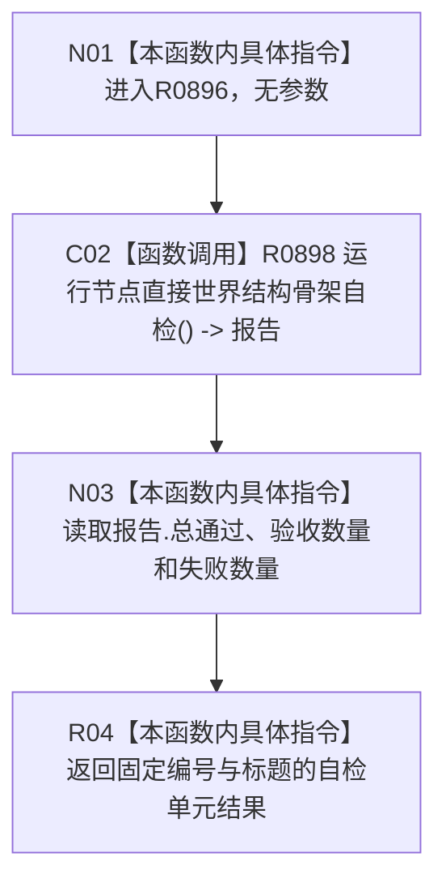

# CF-L3-0025 节点直接世界结构骨架合同包装现状流程图

图类型：现状流程图
代码版本：`4b80f1617dd70ec7a19e1a34efa9da768dce8927`
源码 blob：`d2581161faef19cb494366ee32886ae2b12ee190`
覆盖文件：`海中鱼巣/启动.应用程序.ixx:388-392`
唯一根函数：R0896
完整签名：`海中鱼巣::自检单元结果 海中鱼巣::运行节点直接世界结构骨架合同自检()`
参数：无
返回结果：把 R0898 的报告包装为固定编号 `WORLD-TREE-P1A3F-S01` 的自检单元结果
调用图：正式 main 可达关系表；共享稳定边由顶层维护者收口
逐行映射表：`流程图/代码流程图/L3/CF-L3-0025_节点直接世界结构骨架合同包装_逐行代码映射表.md`
输入契约 / 调用语境表：无独立文件；仅由完整自检登记路径调用
非成功返回二分审查表：无中途返回；失败保留为报告值
偏差清单：无；本函数只包装安全未实现骨架自检结果
依据提交 / 结构化消息：`3242c166`；父任务 R0896 指派
验证输出：本批仅文档机械验证，不运行程序或构建
不得作为施工许可：是
不得宣称：自检包装存在或返回通过即代表世界结构业务能力完成

## 流程图

## 当前边界

- R0896 不执行世界结构读写，只转换 R0898 的报告字段。
- 报告中的“通过”只证明七个骨架在该自检中保持安全未实现返回及零事实变化。
