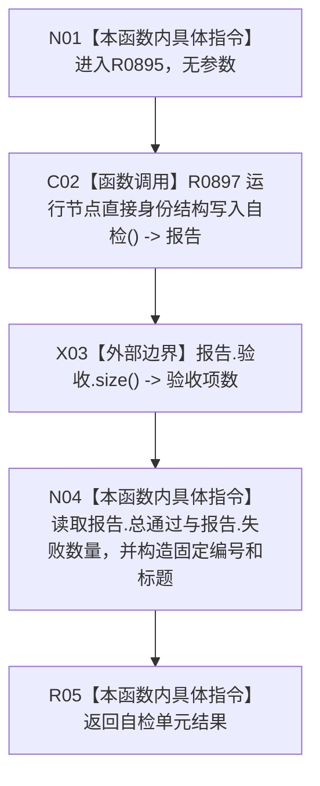

# CF-L3-0026 节点直接类型化结构事务合同自检现状流程图

图类型：现状流程图
代码版本：`4b80f1617dd70ec7a19e1a34efa9da768dce8927`
源码 blob：`d2581161faef19cb494366ee32886ae2b12ee190`
覆盖文件：`海中鱼巣/启动.应用程序.ixx:382-386`
唯一根函数：R0895
完整签名：`自检单元结果 海中鱼巣::运行节点直接类型化结构事务合同自检()`
参数：无
返回结果：把 R0897 的 77 项验收报告包装为固定编号 `WORLD-TREE-P1A2-S01` 的 `自检单元结果`
调用图：正式 main 可达关系表；共享稳定边由顶层维护者收口
逐行映射表：`流程图/代码流程图/L3/CF-L3-0026_节点直接类型化结构事务合同自检_逐行代码映射表.md`
输入契约 / 调用语境表：无独立文件；完整自检登记路径调用，无外部参数
非成功返回二分审查表：无中途返回；R0897 的失败数量和总通过值原样进入返回材料
偏差清单：无；本函数只包装当前自检报告，不产生业务完成事实
依据提交 / 结构化消息：`3242c166`；父任务 R0895 指派
验证输出：本批仅执行 Markdown、Mermaid 与逐行覆盖机械验证，不运行构建或程序
不得作为施工许可：是
不得宣称：返回成功或验收全通过代表节点直接类型化结构事务已经完成生产接线或业务闭环

## 流程图

## 被调函数与稳定身份

| 节点 | 目标 | 参数绑定 | 结果绑定 | 当前边界 |
| --- | --- | --- | --- | --- |
| C02 | R0897；`节点直接身份结构写入自检报告 海中鱼巣::运行节点直接身份结构写入自检()` | 无 | 返回值 -> `报告` | 只消费自检报告，不执行额外事务 |
| X03 | `std::array<bool, 77>::size() const noexcept` | `报告.验收` | 返回值 -> 验收项数 | 标准库只读边界，不生成项目函数流程图 |

## 当前边界

- R0895 不判断或改写 77 项验收内容，只读取 R0897 报告的总通过、项目数量和失败数量。
- 本函数没有显式拒绝、恢复或异常收口分支；R0897 或标准库调用抛出的异常会越过本函数传播。
- 返回材料属于人读自检汇总，不是运行期机器事实、施工许可或能力完成证明。
