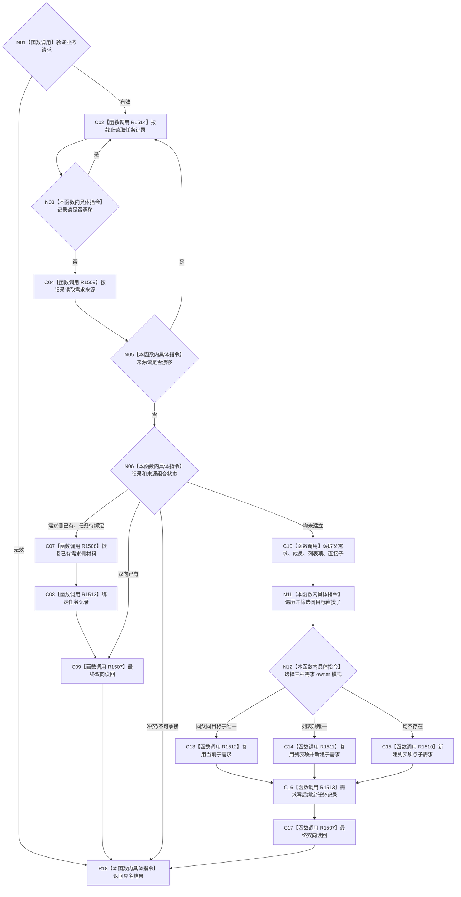

# CF-L3-0028 承接任务子目标记录现状流程图

图类型：现状流程图
代码版本：`d534058e154177d4576f50a92ec448dc3f38a507`
源码 blob：`d03f149888dca1ad51c2c841a28930f29aeb083d`
覆盖文件：`海中鱼巣/领域/服务.需求任务子目标承接.ixx:317-476`
唯一根函数：R1506
完整签名：`需求任务子目标承接结果 海中鱼巣::需求任务子目标承接服务::承接任务子目标记录(const 需求任务子目标承接请求& 请求) noexcept`
参数：`请求`为只读借用；服务借用装配期注入的唯一需求服务与任务子目标记录服务。
返回结果：结构化承接结果；仅成功谓词成立时表示同 G 双向读回闭合。
调用图：`流程图/主程序可达调用关系/05_需求任务子目标承接当前调用子图.md`
逐行映射表：`流程图/代码流程图/L3/CF-L3-0028_承接任务子目标记录_逐行代码映射表.md`
输入契约 / 调用语境表：调用子图“输入契约与非成功二分”
非成功返回二分审查表：调用子图“输入契约与非成功二分”
偏差清单：调用子图“NOT_RUN 与待展开”
依据提交 / 结构化消息：实现提交 `5aada0f2`；当前复核提交 `d534058e`
验证输出：逐源码静态复核；构建、程序与业务自检未运行
不得作为施工许可：是
不得宣称：生产线程已调用、跨 owner 原子、NOT_RUN 已通过或任务 / 需求后继闭环

