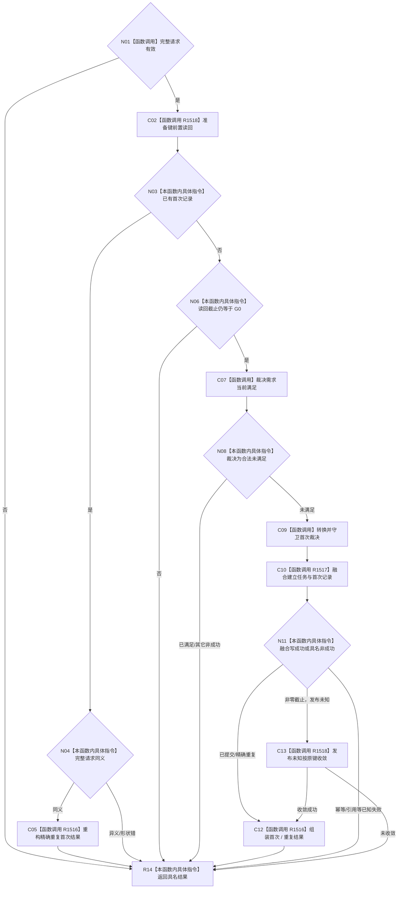

# CF-L3-0029 形成唯一任务与初次筹办工作包现状流程图

图类型：现状流程图
代码版本：`7d3e7c9e32623aaa9aa4b4c90b53ef634eb6f094`
源码 blob：`49d5c31745cdd82eccaf577626706ed22a393409`
覆盖文件：`海中鱼巣/领域/内部治理/服务.需求初次筹办准备.ixx:153-246`
唯一根函数：R1515
完整签名：`需求初次筹办准备结果 海中鱼巣::需求初次筹办准备提供者::形成唯一任务与初次筹办工作包(需求初次筹办准备请求 请求) noexcept`
参数：按值接收完整准备请求；服务借用由构造期注入。
返回结果：首次形成、精确重复、幂等冲突、目标 / 当前性 / 引用 / 许可 / 资源等具名结果。
调用图：`流程图/主程序可达调用关系/06_需求初次筹办工作包当前调用子图.md`
逐行映射表：`流程图/代码流程图/L3/CF-L3-0029_形成唯一任务与初次筹办工作包_逐行代码映射表.md`
输入契约 / 调用语境表：调用子图“输入契约与非成功二分”
非成功返回二分审查表：调用子图“输入契约与非成功二分”
偏差清单：调用子图“当前实现边界与偏差”
依据提交 / 结构化消息：实现 `17edb9d9`；当前复核 `7d3e7c9e`
验证输出：逐源码静态复核；构建、程序和治理专项未运行
不得作为施工许可：是
不得宣称：普通生产线程已调用、工作包已被筹办消费或后继回流 / 重筹办 / 结算已实现

