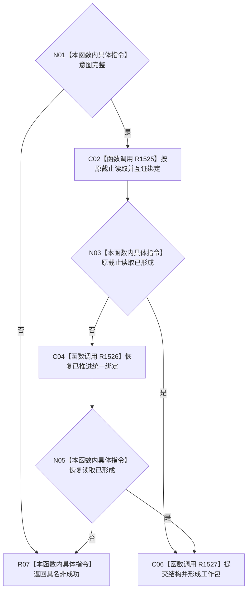

# CF-L3-0030 形成待重筹办与下一筹办工作包现状流程图

图类型：现状流程图
代码版本：`dd8a7810693b7892b3265333f762b7c1c3bcd4d8`；源码 blob：`597af149798c2925b38406f95432c074dba28034`
覆盖文件：`海中鱼巣/领域/内部治理/服务.任务目标未达成重筹办触发.ixx:477-492`
唯一根函数：R1523
完整签名：`任务重筹办触发结果 海中鱼巣::任务目标未达成重筹办触发提供者::形成待重筹办与下一筹办工作包(const 任务重筹办意图& 意图) noexcept`
参数：目标未达成重筹办意图。
返回结果：下一筹办工作包，或入口、漂移、冲突、等待、已消费、资源 / 内部非成功。
调用图：`流程图/主程序可达调用关系/07_任务统一筹办轮次权威当前调用子图.md`；逐行映射表：同目录配对文件。
验证输出：静态源码复核；运行验证未执行
不得作为施工许可：是

