# CF-L4-0001 `运行入口端口合同自检` 现状流程图

图类型：现状流程图
代码版本：`a48a70b2d678dea64dd8228adb4f26f0badd9506`
覆盖文件：`海中鱼巣/启动.应用程序.ixx:176-320`
唯一根函数：F0032
完整签名：`海中鱼巣::自检单元结果 海中鱼巣::运行入口端口合同自检()`
参数：无
返回结果：`海中鱼巣::自检单元结果`
调用图：`流程图/代码流程图/00_调用知识图谱.md`
逐行映射表：`流程图/代码流程图/L4/CF-L4-0001_运行入口端口合同自检_逐行代码映射表.md`
偏差清单：`流程图/代码流程图/00_规范偏差审计.md`
依据提交：冻结代码提交 `a48a70b2d678dea64dd8228adb4f26f0badd9506`
验证输出：文档治理验证待全包闭合时统一执行
不得作为施工许可：是
不得宣称：不得据此宣称入口分层已经符合规范、真实 SQL 往返已经验证、上下文隔离已由地址或生命周期计数机械证明

## 函数合同

本函数构造六轮故障注入端口，核对普通系统初始化的失败状态和调用次序；随后核对数据库写失败、数据库读回不一致、信号安装失败恢复和日志宏关闭零求值。全部结果只进入局部 `自检单元结果`，不发布生产机器事实。

本函数位于生产路由模块，但只由 F0031 登记的显式自检回调调用。正常 UI、headless、生产运行期和专项模式不得因本图而被解释为会执行本函数。

被调函数流程图：

- F0010、F0013—F0015、F0018—F0020、F0025、F0036 已有现状图。
- F0120—F0131 为本轮新增发现的回调或生命周期函数，待按队列逐函数生成。
- F0043—F0046、F0048、F0050 是这些回调内部的条件调用目标，已经在既有队列中。
- `std::array`、`std::function`、`std::optional`、`std::unique_ptr`、`std::count`、字符串和 CRT 信号函数只登记外部边界，不生成项目流程图。

## 流程图

```mermaid
flowchart TD
    N01["N01【本函数内具体指令】值初始化9项验收数组"]
    N02["N02【本函数内具体指令】默认构造普通应用配置"]
    N03["N03【本函数内具体指令】冻结6项期望初始化状态"]
    N04["N04【本函数内具体指令】冻结6乘6期望调用矩阵"]
    N05["N05【本函数内具体指令】失败点置0"]
    N06{"N06【本函数内具体指令】失败点是否小于6"}
    N07["N07【函数调用】F0013 构造普通应用上下文(配置) -> 装配"]
    N08{"N08【函数调用】F0014 装配.成功()"}
    N09["N09【本函数内具体指令】装配失败时写验收[失败点]=false"]
    N10["N10【本函数内具体指令】continue并递增失败点"]
    N11["N11【函数调用】外部unique_ptr解引用并绑定上下文"]
    N12["N12【本函数内具体指令】值初始化6项调用计数"]
    N13["N13【本函数内具体指令】以F0120-F0125六个捕获lambda构造系统初始化端口"]
    N14["N14【函数调用】F0015 初始化普通系统(端口,请求) -> 结果"]
    N15{"N15【本函数内具体指令】结果状态是否等于本轮期望状态"}
    N16{"N16【函数调用】外部array相等比较调用计数与期望调用"}
    N17["N17【本函数内具体指令】把短路结果写入验收[失败点]"]
    N18["N18【函数调用】F0131 上下文成员自我线程在本轮末析构"]
    N19["N19【本函数内具体指令】递增失败点"]

    N20["N20【本函数内具体指令】以F0126-F0128和未调用读回lambda构造写入失败端口"]
    N21["N21【函数调用】F0018 执行启动结构审计(写入失败端口,最佳努力) -> 写入失败"]
    N22["N22【本函数内具体指令】写验收[6]=状态为写入失败"]
    N23["N23【函数调用】外部std::function复制前两个回调"]
    N24["N24【本函数内具体指令】以复制回调和F0129-F0130构造不一致端口"]
    N25["N25【函数调用】F0010 运行数据库专项(&不一致端口) -> 专项"]
    N26{"N26【本函数内具体指令】专项状态是否为审计失败"}
    N27{"N27【本函数内具体指令】失败阶段是否为数据库读回"}
    N28["N28【本函数内具体指令】把短路结果写入验收[7]"]

    N29["N29【本函数内具体指令】值初始化3项信号调用序列"]
    N30["N30【本函数内具体指令】信号调用数量置0"]
    N31["N31【本函数内具体指令】构造F0067信号安装替身"]
    N32["N32【函数调用】F0019 安装程序停止信号(F0067) -> 信号失败"]
    N33["N33【函数调用】F0019 安装程序停止信号(默认std::signal) -> 后续可安装"]
    N34{"N34【本函数内具体指令】失败状态是否为SIGTERM失败"}
    N35{"N35【函数调用】F0020 信号失败.成功()并取反"}
    N36{"N36【本函数内具体指令】替身调用数量是否为3"}
    N37{"N37【本函数内具体指令】序列0是否为SIGINT"}
    N38{"N38【本函数内具体指令】序列1是否为SIGTERM"}
    N39{"N39【本函数内具体指令】序列2是否为SIGINT"}
    N40{"N40【函数调用】F0020 后续可安装.成功()"}
    N41["N41【本函数内具体指令】把短路结果写入验收[8]"]

    N42["N42【函数调用】外部验收.begin()"]
    N43["N43【函数调用】外部验收.end()"]
    N44["N44【函数调用】外部std::count(begin,end,false) -> 失败计数"]
    N45["N45【本函数内具体指令】转换并绑定失败数"]
    N46["N46【本函数内具体指令】日志参数求值计数置0"]
    N47["N47【本函数内具体指令】验收索引置0"]
    N48["N48【函数调用】外部验收.size() -> 9"]
    N49{"N49【本函数内具体指令】验收索引是否小于9"}
    N50A["N50A【本函数内具体指令】宏关闭：日志语句不求值"]
    N50B["N50B【本函数内具体指令】宏开启：日志参数求值计数加1"]
    N51B["N51B【函数调用】外部std::to_wstring(验收索引+1)"]
    N52B["N52B【函数调用】外部wstring拼接验收文本"]
    N53B["N53B【函数调用】F0036 记录调试日志(...)，返回值丢弃"]
    N54["N54【本函数内具体指令】验收索引加1"]
    N55A["N55A【本函数内具体指令】宏关闭：按计数是否为0形成日志关闭零求值"]
    N55B["N55B【本函数内具体指令】宏开启：固定写日志关闭零求值=true"]
    N56{"N56【本函数内具体指令】失败数是否为0"}
    N57{"N57【本函数内具体指令】日志关闭零求值是否为true"}
    N58["N58【函数调用】外部验收.size() -> 总数9"]
    N59["N59【本函数内具体指令】计算最终失败数并构造自检单元结果"]
    N60["N60【函数调用】F0025 后续可安装租约在退出时析构"]
    N61["N61【本函数内具体指令】返回自检单元结果"]

    N01 --> N02 --> N03 --> N04 --> N05 --> N06
    N06 -- "有本轮" --> N07 --> N08
    N08 -- "否" --> N09 --> N10 --> N06
    N08 -- "是" --> N11 --> N12 --> N13 --> N14 --> N15
    N15 -- "否" --> N17
    N15 -- "是" --> N16 --> N17 --> N18 --> N19 --> N06
    N17 --> N18
    N06 -- "六轮结束" --> N20 --> N21 --> N22 --> N23 --> N24 --> N25 --> N26
    N26 -- "否" --> N28
    N26 -- "是" --> N27 --> N28 --> N29
    N28 --> N29 --> N30 --> N31 --> N32 --> N33 --> N34
    N34 -- "否" --> N41
    N34 -- "是" --> N35
    N35 -- "否" --> N41
    N35 -- "是" --> N36
    N36 -- "否" --> N41
    N36 -- "是" --> N37
    N37 -- "否" --> N41
    N37 -- "是" --> N38
    N38 -- "否" --> N41
    N38 -- "是" --> N39
    N39 -- "否" --> N41
    N39 -- "是" --> N40 --> N41 --> N42
    N41 --> N42 --> N43 --> N44 --> N45 --> N46 --> N47 --> N48 --> N49
    N49 -- "有项且宏关闭" --> N50A --> N54 --> N48
    N49 -- "有项且宏开启" --> N50B --> N51B --> N52B --> N53B --> N54
    N49 -- "循环结束且宏关闭" --> N55A --> N56
    N49 -- "循环结束且宏开启" --> N55B --> N56
    N56 -- "否" --> N58
    N56 -- "是" --> N57 --> N58 --> N59 --> N60 --> N61
```

## 项目源码调用合同

| 调用节点 | 被调函数 | 参数 / 输入绑定 | 结果 / 输出绑定 | 调用条件与类型 | 被调图 |
| --- | --- | --- | --- | --- | --- |
| N07 | F0013 `普通应用装配结果 构造普通应用上下文(const 普通应用配置&)` | `配置` | `装配` | 六轮各一次；直接调用 | [已有图](../L3/CF-L3-0001_构造普通应用上下文_现状流程图.md) |
| N08 | F0014 `bool 普通应用装配结果::成功() const noexcept` | `this=&装配` | bool | 每轮装配后 | [已有图](../L3/CF-L3-0002_普通应用装配结果_成功_现状流程图.md) |
| N14 | F0015 `系统初始化结果 初始化普通系统(const 系统初始化端口&, const 系统初始化请求&)` | 六个故障注入端口；配置的稳定键和根需求参数 | `结果` | 装配成功；六轮 | [已有图](../L3/CF-L3-0003_初始化普通系统_现状流程图.md) |
| N18 | F0131 `自我线程::~自我线程()` | 本轮上下文成员 | void | 本轮作用域退出；若已启动则停止、唤醒并 join | 待生成 |
| N21 | F0018 `数据库启动审计结果 执行启动结构审计(...)` | 写入失败端口；最佳努力 | `写入失败` | 六轮后 | [已有图](../L3/CF-L3-0006_执行启动结构审计_现状流程图.md) |
| N25 | F0010 `程序运行结果 运行数据库专项(const 数据库启动审计端口*)` | `&不一致端口` | `专项` | 写入失败验收后 | [已有图](../L2/CF-L2-0005_运行数据库专项_现状流程图.md) |
| N32/N33 | F0019 `停止信号安装结果 安装程序停止信号(程序信号安装函数)` | F0067 替身 / 默认 `std::signal` 包装 | `信号失败` / `后续可安装` | 顺序调用两次 | [已有图](../L3/CF-L3-0007_安装程序停止信号_现状流程图.md) |
| N35/N40 | F0020 `bool 停止信号安装结果::成功() const noexcept` | 两个不同结果对象 | bool | 短路链 | [已有图](../L3/CF-L3-0008_停止信号安装结果_成功_现状流程图.md) |
| N53B | F0036 `bool 记录调试日志(...)` | 具名切片、模块、入口、动态内容 | 返回值丢弃 | 仅日志宏开启；每项至多一次 | [已有图](../L3/CF-L3-0022_记录调试日志_现状流程图.md) |
| N60 | F0025 `停止信号租约::~停止信号租约()` | `后续可安装.租约` | void | 根函数退出且租约存在 | [已有图](../L3/CF-L3-0013_停止信号租约_析构_现状流程图.md) |

## 回调目标与动态调用闭合

| 回调身份 | 完整签名与定义 | 实际调用方 / 次数 | 内部项目调用 |
| --- | --- | --- | --- |
| F0120 | `std::optional<方法登记根材料> <lambda@205>::operator()(std::uint64_t 键) const` | F0015；6 次 | F0043；失败点1—5共5次 |
| F0121 | `自我线程操作结果 <lambda@211>::operator()(const 自我根需求初始化参数& 参数) const` | F0015；5 次 | F0044；失败点2—5共4次 |
| F0122 | `bool <lambda@217>::operator()(std::chrono::milliseconds 时限) const` | F0015；4 次 | F0045；失败点3—5共3次 |
| F0123 | `std::optional<自我线程初始化快照> <lambda@223>::operator()() const` | F0015；4 次 | F0046；失败点2、4、5共3次 |
| F0124 | `概念图初始化结果 <lambda@229>::operator()() const` | F0015；2 次 | F0048；失败点5共1次 |
| F0125 | `std::optional<节点句柄> <lambda@235>::operator()(节点句柄 实例) const` | F0015；1 次 | F0050 语法存在，但唯一到达轮次被故障分支截断，实际0次 |
| F0126 | `缓存命名空间 <lambda@249>::operator()() const` | F0018 两条审计路径；2次 | 无 |
| F0127 | `结构统计快照 <lambda@252>::operator()(缓存命名空间) const` | F0018 两条审计路径；2次 | 无 |
| F0128 | `数据库操作结果 <lambda@257>::operator()(const 结构统计快照&, std::wstring) const` | F0018 写失败路径；1次 | 无 |
| 未入队 | `数据库查询结果 <lambda@258>::operator()(std::size_t) const` | 固定写失败先返回，0次 | 动态不可达，不属于本根的可达函数闭包 |
| F0129 | `数据库操作结果 <lambda@267>::operator()(const 结构统计快照&, std::wstring) const` | F0018 经 F0010；1次 | 无 |
| F0130 | `数据库查询结果 <lambda@273>::operator()(std::size_t) const` | F0018 经 F0010；1次 | 外部 `vector::push_back` |
| F0067 | `程序信号处理函数 <lambda@287>::operator()(int 信号, 程序信号处理函数) const` | F0019 两次安装并由 F0025 恢复；序列3次 | 无；不会调用传入处理器 |

`接收程序停止信号(int)` 只被交给 `std::signal` 注册；本函数没有投递信号，因此登记为回调注册边，不计入本函数实际执行调用。

## 输入契约与调用语境

| 入口 | 调用方 | 输入来源 | 上游保证 | 允许逻辑内返回 | 结构变化 |
| --- | --- | --- | --- | --- | --- |
| F0032 | F0031 顺序150的登记回调 | 显式完整自检运行器；无参数 | 只保证自检运行器按序调用，不保证所有外部环境可用 | 所有故障均折叠为结构化失败项，函数自身无提前返回 | 每轮创建并销毁隔离上下文；不发布生产机器事实 |
| F0015 故障端口 | 本函数局部六个 lambda | 当前失败点、调用计数和上下文引用 | 装配成功且引用仅在本轮存活 | 故障注入按期望阶段返回失败材料 | 可能在隔离上下文内建立方法根、自我线程和概念根 |
| F0018/F0010 替身端口 | 本函数局部数据库 lambda | 固定命名空间、快照和替身结果 | 不连接真实 SQL | 写失败或读回不一致属于本自检预期 | 仅替身 DTO；不写数据库 |

## 非成功返回二分审查

| 节点 / 条件 | 当前行为 | 二分口径 | 理由 |
| --- | --- | --- | --- |
| N08 装配失败 | 当前轮验收失败并继续下一轮 | 逻辑内返回 | 自检保持其余故障矩阵可执行 |
| N14 初始化状态或调用次数不符 | 当前轮验收失败 | 追根因解决 | 固定故障注入应产生精确状态和顺序 |
| N21 写入替身未报告写入失败 | 验收6失败 | 追根因解决 | 端口固定返回写失败 |
| N25 数据库专项未在读回阶段失败 | 验收7失败 | 追根因解决 | 覆盖端口固定制造读回不一致 |
| N32 信号安装失败未恢复 SIGINT | 验收8失败 | 追根因解决 | 失败租约析构必须恢复已安装处理器 |
| N55A 宏关闭仍求值日志参数 | 最终失败数额外加1 | 追根因解决 | 日志关闭必须不求值仅供日志的参数 |

## 当前偏差与证据边界

- 本函数定义在 `启动.应用程序.ixx`，与“自检正文属于独立自检模块”的现行分层目标不一致；这里只记录现状，不在图中伪写为已迁移。
- 六轮 `unique_ptr` 生命周期顺序不重叠，函数返回时各轮对象析构；但代码没有 `live_count`、构造/析构事件或跨项引用扫描，不能把“地址不同”或单纯作用域写成完整隔离证明。
- 数据库两项只验证注入端口的状态传播，不是 SQL Server 真实往返证据。
- `日志关闭零求值` 在宏开启分支固定为 `true`，只证明该构建不执行关闭态哨兵；不能冒充关闭态验证。
- 返回总项数固定为9，但关闭态哨兵失败会把失败数加到10，结果字段可能出现 `失败数 > 总数`。
- 未解析调用：0。
