# CF-L4-0002 `运行入口隔离合同自检` 现状流程图

图类型：现状流程图
代码版本：`0a93526882cb33c61c2fbb04ecad1aeaddcfe225`
当前工作区复核基线：`ece29318f80cad2ce7a4abce9b009c60cd4cdfdd`
源码 blob：`a199d2da44f762aa6f4877c1a216eb1b1c99beba`
覆盖文件：`海中鱼巣/启动.应用程序.ixx:322-377`
唯一根函数：F0033
完整签名：`海中鱼巣::自检单元结果 海中鱼巣::运行入口隔离合同自检()`
参数：无
返回结果：`海中鱼巣::自检单元结果`
调用图：`流程图/代码流程图/00_调用知识图谱.md`
逐行映射表：`流程图/代码流程图/L4/CF-L4-0002_运行入口隔离合同自检_逐行代码映射表.md`
偏差清单：`流程图/代码流程图/00_规范偏差审计.md`
依据提交：冻结代码提交 `0a93526882cb33c61c2fbb04ecad1aeaddcfe225`
验证输出：文档治理验证待全包闭合时统一执行
不得作为施工许可：是
不得宣称：不得据此宣称15次历史裸地址必须不同、15次构造析构已有计数配对证据、跨项共享状态已经由地址非零独立排除

## 函数合同

本函数运行两个局部自检批次。第一批核对15个固定编号、每次观察时上下文地址非零以及初始化前节点/关系/索引数量为零；第二批强制 S08 失败，核对15项仍全部执行且只有 S08 失败。日志宏关闭时只服务日志的表达式必须不求值。全部结果折叠为2项结构化自检结果，不写生产机器事实。

当前代码已经移除“15个裸地址两两不同”断言。各 S01—S15 的局部环境在单项返回时析构，后续分配合法复用同一地址；地址复用既不证明串扰，也不证明隔离。

被调函数流程图：

- F0029、F0031、F0036 已有现状图。
- F0132、F0133 是本函数构造并经下游环境构造函数实际调用的两个观察 lambda，待单独生成。
- F0029 登记、F0031 调度当前 S01—S15 的15个自检适配 lambda；其具名目标和环境构造函数由对应独立图继续承载。
- 标准库容器、字符串、`std::optional`、`std::function` 和预编译分支只登记外部边界。

## 流程图

```mermaid
flowchart TD
    N01["N01【函数调用】外部默认构造第一编号组vector"]
    N02["N02【本函数内具体指令】第一地址全非零置true"]
    N03["N03【本函数内具体指令】第一初始为零置true"]
    N04["N04【本函数内具体指令】默认构造第一配置"]
    N05["N05【函数调用】外部std::function构造并绑定F0132观察回调"]
    N06["N06【本函数内具体指令】默认构造第一运行器"]
    N07["N07【函数调用】F0029 登记入口初始化自检单元(第一运行器,第一配置) -> 第一登记"]
    N08["N08【函数调用】F0031 第一运行器.运行全部() -> 第一批次"]
    N09["N09【函数调用】外部构造含S01至S15的固定编号vector"]
    N10{"N10【本函数内具体指令】第一登记是否为true"}
    N11{"N11【本函数内具体指令】第一批次是否总通过"}
    N12{"N12【本函数内具体指令】登记数量是否为15"}
    N13{"N13【本函数内具体指令】执行数量是否为15"}
    N14{"N14【函数调用】外部vector相等比较第一编号组与固定编号组"}
    N15{"N15【本函数内具体指令】第一地址是否全非零"}
    N16{"N16【本函数内具体指令】第一初始计数是否全零"}
    N17["N17【本函数内具体指令】把短路结果写入第一通过"]

    N18["N18【本函数内具体指令】默认构造第二配置"]
    N19["N19【函数调用】外部string构造并赋给强制失败编号optional"]
    N20["N20【本函数内具体指令】第二观察数量置0"]
    N21["N21【函数调用】外部std::function构造并绑定F0133观察回调"]
    N22["N22【本函数内具体指令】默认构造第二运行器"]
    N23["N23【函数调用】F0029 登记入口初始化自检单元(第二运行器,第二配置) -> 第二登记"]
    N24["N24【函数调用】F0031 第二运行器.运行全部() -> 第二批次"]
    N25{"N25【本函数内具体指令】第二登记是否为true"}
    N26{"N26【本函数内具体指令】第二批次是否未总通过"}
    N27{"N27【本函数内具体指令】登记数量是否为15"}
    N28{"N28【本函数内具体指令】执行数量是否为15"}
    N29{"N29【本函数内具体指令】失败数量是否为1"}
    N30{"N30【本函数内具体指令】第二观察数量是否为15"}
    N31["N31【函数调用】外部构造仅含S08的临时vector"]
    N32{"N32【函数调用】外部vector相等比较失败编号组与临时vector"}
    N33["N33【本函数内具体指令】把短路结果写入第二通过"]

    N34["N34【本函数内具体指令】日志参数求值计数置0"]
    N35A["N35A【本函数内具体指令】宏关闭：整条日志语句不求值"]
    N35B["N35B【本函数内具体指令】宏开启：日志参数求值计数加1"]
    N36B["N36B【函数调用】外部第一编号组.size() -> 编号数"]
    N37B["N37B【函数调用】外部std::to_wstring(编号数)"]
    N38B["N38B【函数调用】外部wstring拼接两批结果、地址和初始计数文本"]
    N39B["N39B【函数调用】F0036 记录调试日志(...)，返回值丢弃"]
    N40A["N40A【本函数内具体指令】宏关闭：按计数是否为0形成日志关闭零求值"]
    N40B["N40B【本函数内具体指令】宏开启：固定写日志关闭零求值=true"]
    N41["N41【本函数内具体指令】计算第一批失败量"]
    N42["N42【本函数内具体指令】计算第二批失败量"]
    N43["N43【本函数内具体指令】计算日志宏失败量"]
    N44["N44【本函数内具体指令】三项相加形成失败数"]
    N45{"N45【本函数内具体指令】失败数是否为0"}
    N46["N46【本函数内具体指令】构造总数固定为2的自检单元结果"]
    N47["N47【函数调用】外部析构两个运行器、配置、回调和vector"]
    N48["N48【本函数内具体指令】返回自检单元结果"]

    N01 --> N02 --> N03 --> N04 --> N05 --> N06 --> N07 --> N08 --> N09 --> N10
    N10 -- "否" --> N17
    N10 -- "是" --> N11
    N11 -- "否" --> N17
    N11 -- "是" --> N12
    N12 -- "否" --> N17
    N12 -- "是" --> N13
    N13 -- "否" --> N17
    N13 -- "是" --> N14
    N14 -- "否" --> N17
    N14 -- "是" --> N15
    N15 -- "否" --> N17
    N15 -- "是" --> N16 --> N17 --> N18
    N17 --> N18 --> N19 --> N20 --> N21 --> N22 --> N23 --> N24 --> N25
    N25 -- "否" --> N33
    N25 -- "是" --> N26
    N26 -- "否" --> N33
    N26 -- "是" --> N27
    N27 -- "否" --> N33
    N27 -- "是" --> N28
    N28 -- "否" --> N33
    N28 -- "是" --> N29
    N29 -- "否" --> N33
    N29 -- "是" --> N30
    N30 -- "否" --> N33
    N30 -- "是" --> N31 --> N32 --> N33 --> N34
    N33 --> N34
    N34 --> N35A --> N40A
    N34 --> N35B --> N36B --> N37B --> N38B --> N39B --> N40B
    N40A --> N41
    N40B --> N41 --> N42 --> N43 --> N44 --> N45 --> N46 --> N47 --> N48
```

## 项目源码调用合同

| 调用节点 | 被调函数 | 参数 / 输入绑定 | 结果 / 输出绑定 | 调用条件与类型 | 被调图 |
| --- | --- | --- | --- | --- | --- |
| N07/N23 | F0029 `bool 登记入口初始化自检单元(自检运行器&, const 入口初始化自检运行配置&)` | 第一/第二运行器及对应配置 | 第一/第二登记 | 顺序两次直接调用 | [已有图](../L3/CF-L3-0017_登记入口初始化自检单元_现状流程图.md) |
| N08/N24 | F0031 `自检批次结果 自检运行器::运行全部()` | `this=&第一运行器` / `this=&第二运行器` | 第一/第二批次 | 各自登记后直接成员调用 | [已有图](../L3/CF-L3-0019_自检运行器_运行全部_现状流程图.md) |
| N39B | F0036 `bool 记录调试日志(...)` | 入口初始化切片、模块、入口、拼接内容 | 返回值丢弃 | 仅入口初始化自检日志宏开启 | [已有图](../L3/CF-L3-0022_记录调试日志_现状流程图.md) |
| N05 | F0132 `void <lambda@327>::operator()(std::string_view, std::uintptr_t, 入口初始化自检初始计数) const` | 捕获第一编号组、第一地址全非零、第一初始为零 | 修改捕获状态 | 此处绑定；下游每个 Sxx 环境构造时调用，共15次 | 待生成 |
| N21 | F0133 `void <lambda@350>::operator()(std::string_view, std::uintptr_t, 入口初始化自检初始计数) const` | 捕获第二观察数量 | 数量加1 | 此处绑定；第二批每个 Sxx 环境构造时调用，共15次 | 待生成 |

## 输入契约与调用语境

| 入口 | 调用方 | 输入来源 | 上游保证 | 允许逻辑内返回 | 结构变化 |
| --- | --- | --- | --- | --- | --- |
| F0033 | F0031 顺序160的登记回调 | 显式完整自检模式；无参数 | 中央运行器已完成登记，不保证子项通过 | 两批任一失败都形成结构化失败结果，不提前返回 | 只写局部自检证据；各 Sxx 自有隔离上下文 |
| F0132/F0133 | 下游 `构造入口初始化自检环境` 的观察槽 | 编号、当前存活上下文地址、初始化前计数 | 地址仅在回调期间有效 | 回调无失败返回 | 只写 F0033 自动存储期内的观察状态 |

## 非成功返回二分审查

| 条件 | 当前行为 | 二分口径 | 理由 |
| --- | --- | --- | --- |
| 第一批登记、执行、编号顺序、地址非零或初始计数任一不符 | 第一通过为false，最终失败数加1 | 自检逻辑内返回 | 不发布生产事实，保留第二批继续验证 |
| 第二批未做到只让S08失败且15项全执行 | 第二通过为false，最终失败数加1 | 自检逻辑内返回 | 故障注入合同失败进入结构化结果 |
| 日志宏关闭仍求值日志参数 | 日志关闭零求值为false，失败数加1 | 追根因解决 | 违反日志宏关闭零求值合同 |
| 登记回调抛异常 | F0031 把对应项记失败并继续 | 自检逻辑内返回 | 运行器合同允许把异常折叠为具名失败 |

## 生命周期与隔离证据

当前代码直接证明：

- 两批分别登记并执行15项；
- 第一批观察编号顺序固定，每次回调期间上下文地址非零，初始化前节点/关系/索引均为0；
- 第二批观察15次，强制且仅 S08 失败，其余项目继续；
- S01—S15 各自持有局部 `unique_ptr` 环境，单项返回后析构，再由运行器调用下一项；
- 没有地址集合，也没有跨生命周期地址互异比较。

当前代码没有 `live_count=1/0`、15次构造与15次析构事件、`peak_live_count=1` 或跨项引用扫描。因此本函数只能结合下游所有权代码证明顺序局部生命周期，不能单独宣称完整机械隔离证据已经闭合。

## 当前偏差

- 本函数仍定义在 `启动.应用程序.ixx`，与自检正文应归属独立自检模块的现行分层目标不一致。
- 观察地址只验证当前回调期间对象非空，不是稳定身份，也不裁决跨项相等或隔离。
- `日志关闭零求值` 在宏开启分支固定为true，只隔离构建口径，不能作为关闭态已验证证据。
- 返回总项数固定2，但关闭态哨兵失败可使失败数达到3，存在 `失败数 > 总数` 的结果计数差异。
- 未解析调用：0。
