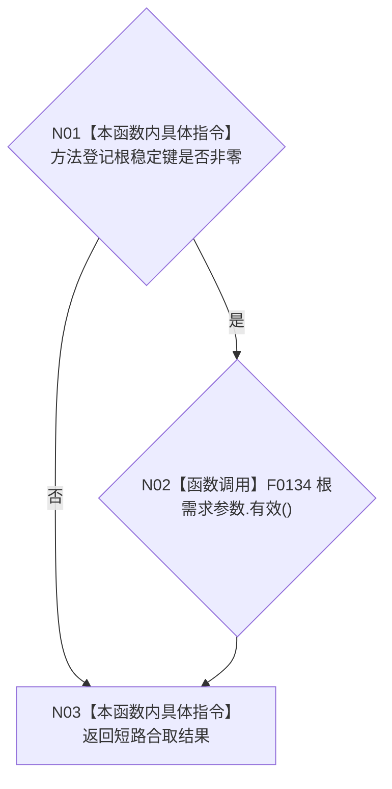

# CF-L4-0003 `普通应用配置::有效` 现状流程图

图类型：现状流程图
代码版本：`a48a70b2d678dea64dd8228adb4f26f0badd9506`
覆盖文件：`海中鱼巣/装配.普通应用.ixx:47-49`
唯一根函数：F0039
完整签名：`bool 海中鱼巣::普通应用配置::有效() const noexcept`
参数：无显式参数；隐式 `this` 指向只读 `普通应用配置`
返回结果：方法登记根稳定键非零且根需求参数有效时返回 `true`，否则返回 `false`
调用图：`流程图/代码流程图/00_调用知识图谱.md`
逐行映射表：`流程图/代码流程图/L4/CF-L4-0003_普通应用配置_有效_逐行代码映射表.md`
偏差清单：`流程图/代码流程图/00_规范偏差审计.md`
依据提交：冻结代码提交 `a48a70b2d678dea64dd8228adb4f26f0badd9506`
验证输出：文档治理验证待全包闭合时统一执行
不得作为施工许可：是
不得宣称：不得据此宣称数据库审计开关、外部依赖或应用上下文已经验证

## 流程图

## 项目源码调用合同

| 调用节点 | 被调函数 | 参数 / 输入绑定 | 结果 / 输出绑定 | 调用条件与类型 | 被调图 |
| --- | --- | --- | --- | --- | --- |
| N02 | F0134 `bool 自我根需求初始化参数::有效() const` | `this=&根需求参数` | bool作为合取右项 | 方法登记根稳定键非零；直接只读成员调用 | 待生成 |

## 输入契约与调用语境

| 调用方 | 输入来源 | 上游保证 | 逻辑内返回 | 结构变化 |
| --- | --- | --- | --- | --- |
| F0013 `构造普通应用上下文` | 调用方传入的普通应用配置 | 不预设有效 | `false` 使装配返回配置无效 | 无，只读配置 |

## 非成功返回二分审查

返回 `false` 是配置准入的逻辑内返回，不写半结构；F0013 据此在构造任何上下文前返回 `配置无效`。本函数没有内部结构异常路径。

## 当前偏差

`启用数据库审计` 字段不参与本函数有效性判断；当前普通程序仍在上层按该字段选择是否执行审计。这不是本函数内确认偏差。未解析调用：0。
