# CF-L4-0004 `普通应用上下文::普通应用上下文` 现状流程图

图类型：现状流程图
代码版本：`a48a70b2d678dea64dd8228adb4f26f0badd9506`
覆盖文件：`海中鱼巣/装配.普通应用.ixx:54-78`；成员声明顺序证据 `85-110`
唯一根函数：F0040
完整签名：`海中鱼巣::普通应用上下文::普通应用上下文()`
参数：无
返回结果：构造函数无返回值；全部成员成功后形成完整 `普通应用上下文`
调用图：`流程图/代码流程图/00_调用知识图谱.md`
逐行映射表：`流程图/代码流程图/L4/CF-L4-0004_普通应用上下文_构造_逐行代码映射表.md`
偏差清单：`流程图/代码流程图/00_规范偏差审计.md`
依据提交：冻结代码提交 `a48a70b2d678dea64dd8228adb4f26f0badd9506`
验证输出：文档治理验证待全包闭合时统一执行
不得作为施工许可：是
不得宣称：不得据此宣称系统初始化、数据库连接或任何业务结构已经建立

## 函数合同

无基类。C++ 按成员声明顺序 `主信息` 至 `数据库` 构造，不按初始化列表的视觉顺序裁决。`主信息`、`统计`、`显示` 没有写在初始化列表中仍会在其声明位置构造；数据库配置表达式只在 `统计`、`显示` 构造完成后求值。

上下文按值拥有26个成员；后构造成员只保存对已构造前序仓库/服务的非拥有引用。正常析构按声明逆序；其中 F0131 `自我线程::~自我线程()` 是唯一已发现的显式项目源码成员析构函数。

## 流程图

```mermaid
flowchart TD
    N01["N01【函数调用】F0135 构造主信息仓库 -> 主信息"]
    N02["N02【函数调用】F0136 构造节点仓库(主信息) -> 节点"]
    N03["N03【函数调用】F0137 构造关系仓库(节点) -> 关系"]
    N04["N04【函数调用】F0138 构造索引仓库(节点) -> 索引"]
    N05["N05【函数调用】F0139 构造存在服务(主信息,节点,关系)"]
    N06["N06【函数调用】F0140 构造场景服务(主信息,节点,关系)"]
    N07["N07【函数调用】F0141 构造状态服务(主信息,节点,关系)"]
    N08["N08【函数调用】F0142 构造动态服务(主信息,节点,关系)"]
    N09["N09【函数调用】F0143 构造二次特征服务(主信息,节点,关系)"]
    N10["N10【函数调用】F0144 构造语素服务(主信息,节点,关系,索引)"]
    N11["N11【函数调用】F0145 构造特征值服务(主信息,节点)"]
    N12["N12【函数调用】F0146 构造因果服务(主信息,节点)"]
    N13["N13【函数调用】F0147 构造概念图服务(节点,关系)"]
    N14["N14【函数调用】F0148 构造概念图初始化服务(七项依赖)"]
    N15["N15【函数调用】F0149 构造特征服务(五项依赖)"]
    N16["N16【函数调用】F0150 构造世界服务(九项依赖)"]
    N17["N17【函数调用】F0151 构造世界树初始化服务(六项依赖)"]
    N18["N18【函数调用】F0152 构造语素初始化服务(五项依赖)"]
    N19["N19【函数调用】F0153 构造需求服务(主信息,节点,关系)"]
    N20["N20【函数调用】F0154 构造需求初始化服务(四项依赖)"]
    N21["N21【函数调用】F0155 构造自我线程(三个初始化服务)"]
    N22["N22【函数调用】F0156 构造任务服务(主信息,节点,关系)"]
    N23["N23【函数调用】F0157 构造方法服务(主信息,节点,关系)"]
    N24["N24【函数调用】编译器隐式默认构造统计服务"]
    N25["N25【函数调用】编译器隐式默认构造显示服务"]
    N26["N26【函数调用】F0158 SQL数据库适配::从环境创建配置() -> 临时配置"]
    N27["N27【函数调用】F0159 构造SQL数据库适配(移动临时配置)"]
    N28["N28【本函数内具体指令】执行空构造函数体"]
    N29["N29【本函数内具体指令】完整上下文构造完成"]
    N01 --> N02 --> N03 --> N04 --> N05 --> N06 --> N07 --> N08 --> N09 --> N10
    N10 --> N11 --> N12 --> N13 --> N14 --> N15 --> N16 --> N17 --> N18 --> N19
    N19 --> N20 --> N21 --> N22 --> N23 --> N24 --> N25 --> N26 --> N27 --> N28 --> N29
```

## 项目源码调用合同

| 节点 | 被调函数 | 输入绑定 | 结果绑定 | 被调图 |
| --- | --- | --- | --- | --- |
| N01 | F0135 `主信息仓库::主信息仓库(std::uint64_t, 结构事务接线)` | 默认仓库编号1、默认接线 | `主信息` | 待生成 |
| N02 | F0136 `节点仓库::节点仓库(const 主信息仓库&, std::uint64_t, 结构事务接线)` | `主信息`、1、默认接线 | `节点` | 待生成 |
| N03 | F0137 `关系仓库::关系仓库(const 节点仓库&, std::uint64_t, 结构事务接线)` | `节点`、1、默认接线 | `关系` | 待生成 |
| N04 | F0138 `索引仓库::索引仓库(const 节点仓库&, 结构事务接线)` | `节点`、默认接线 | `索引` | 待生成 |
| N05-N10 | F0139-F0144 六个领域服务构造 | 前序仓库引用 | 对应按值服务成员 | 待生成 |
| N11-N13 | F0145-F0147 特征值、因果、概念图服务构造 | 前序仓库/服务引用 | 对应按值服务成员 | 待生成 |
| N14-N20 | F0148-F0154 七个组合/初始化服务构造 | 图中具名前序依赖 | 对应按值服务成员 | 待生成 |
| N21 | F0155 `自我线程::自我线程(语素初始化服务&, 世界树初始化服务&, 需求初始化服务&)` | 三个已构造初始化服务 | `自我线程实例` | 待生成 |
| N22-N23 | F0156-F0157 任务服务、方法服务构造 | 主信息、节点、关系 | 对应按值服务成员 | 待生成 |
| N26 | F0158 `SQL数据库配置 SQL数据库适配::从环境创建配置()` | 无 | 临时配置 | 待生成 |
| N27 | F0159 `SQL数据库适配::SQL数据库适配(SQL数据库配置)` | 移动临时配置 | `数据库` | 待生成 |

N24、N25 是无项目源码函数体的隐式默认构造，只登记编译器边界，不入函数队列。

## 输入、所有权与生命周期

| 范围 | 合同 |
| --- | --- |
| 输入 | 无参数；仓库编号和事务接线使用各构造函数默认值 |
| 所有权 | 上下文按值独占全部26个成员；服务内部引用不拥有其依赖 |
| 构造顺序 | 严格依成员声明 `85-110`；后序成员只能引用已构造成员 |
| 正常析构 | 数据库至主信息逆序；F0131 在任务/方法之后、需求初始化之前收口线程 |
| 构造失败 | 当前成员不视为已构造；先前成员逆序析构；异常继续传播，完整上下文本体析构不执行 |
| 上层收口 | F0013 的 `try/catch(...)` 把异常折叠为 `普通应用装配状态::构造失败` |

## 非成功返回二分审查

本函数没有显式分支或返回值。成员构造抛异常属于资源/构造失败传播，不产生可读半结构；上层 F0013 将其作为结构化装配失败逻辑内返回。若已经通过前置条件的项目构造函数产生违反内部不变量的异常，仍需在对应被调函数图中按“追根因解决”审查。

## 当前偏差

当前构造只装配仓库、服务、线程对象和数据库适配器，不执行方法根、世界树、语素、需求或概念图初始化，符合装配与初始化分离方向。`从环境创建配置()` 只形成数据库配置，不连接或读回数据库。未解析调用：0。
