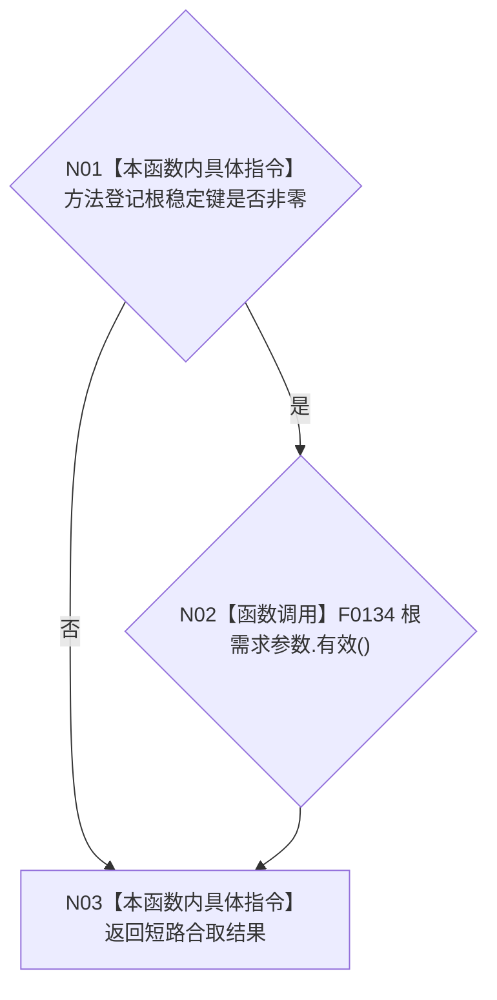

# CF-L4-0005 `系统初始化请求::有效` 现状流程图

图类型：现状流程图
代码版本：`a48a70b2d678dea64dd8228adb4f26f0badd9506`
覆盖文件：`海中鱼巣/领域/初始化.系统.ixx:23-25`
唯一根函数：F0041
完整签名：`bool 海中鱼巣::系统初始化请求::有效() const noexcept`
参数：无显式参数；隐式 `this` 为只读请求
返回结果：方法登记根稳定键非零且根需求参数有效时返回 `true`
调用图：`流程图/代码流程图/00_调用知识图谱.md`
逐行映射表：`流程图/代码流程图/L4/CF-L4-0005_系统初始化请求_有效_逐行代码映射表.md`
不得作为施工许可：是

项目调用：N02 把 `this=&根需求参数` 绑定给 F0134，结果作为合取右项；只在 N01 为真时调用。被调图待生成。

输入语境：F0015 在写任何初始化结构前调用本函数。返回 `false` 是请求准入的逻辑内返回，F0015 据此返回 `请求无效`；本函数只读且无内部异常路径。当前无确认规范偏差，未解析调用0。
