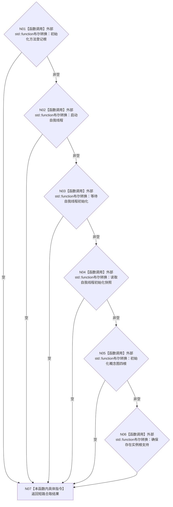

# CF-L4-0006 `系统初始化端口::完整` 现状流程图

图类型：现状流程图
代码版本：`a48a70b2d678dea64dd8228adb4f26f0badd9506`
覆盖文件：`海中鱼巣/领域/初始化.系统.ixx:36-43`
唯一根函数：F0042
完整签名：`bool 海中鱼巣::系统初始化端口::完整() const noexcept`
参数：无显式参数；隐式 `this` 为只读端口聚合
返回结果：六个 `std::function` 槽全部非空时返回 `true`
调用图：`流程图/代码流程图/00_调用知识图谱.md`
逐行映射表：`流程图/代码流程图/L4/CF-L4-0006_系统初始化端口_完整_逐行代码映射表.md`
不得作为施工许可：是

六个调用均是标准库外部边界，不执行所绑定项目回调，也不产生项目源码被调函数。F0015 在任何端口调用前使用本函数；`false` 是端口准入的逻辑内返回，映射为 `系统初始化状态::端口无效`。本函数只读、不写结构、未解析调用0，当前无确认规范偏差。
