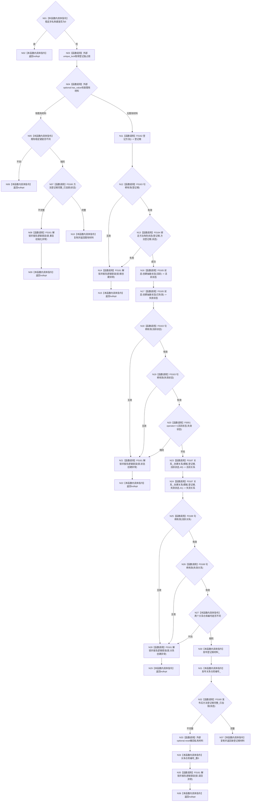

# CF-L4-0007 `方法服务::初始化方法登记根` 现状流程图

图类型：现状流程图
代码版本：`a48a70b2d678dea64dd8228adb4f26f0badd9506`
覆盖文件：`海中鱼巣/领域/方法服务.h:254-302`
唯一根函数：F0043
完整签名：`std::optional<海中鱼巣::方法登记根材料> 海中鱼巣::方法服务::初始化方法登记根(std::uint64_t 稳定非名称键, 海中鱼巣::状态服务& 状态)`
参数：稳定非名称键按值；状态为非拥有可写引用
返回结果：首次完整创建或同键幂等读回时返回材料；入口拒绝、身份冲突或内部异常时返回 `nullopt`
调用图：`流程图/代码流程图/00_调用知识图谱.md`
逐行映射表：`流程图/代码流程图/L4/CF-L4-0007_方法服务_初始化方法登记根_逐行代码映射表.md`
偏差清单：`流程图/代码流程图/00_规范偏差审计.md`
不得作为施工许可：是

## 项目源码调用合同

| ID | 函数 | 调用位置 / 次数 | 输入与结果 |
| --- | --- | --- | --- |
| F0160 | `bool 方法登记根完整_已加锁(const 状态服务&) const` | 263、295 | 状态引用；返回既有/发布后完整性 |
| F0161 | `void 解锁并报告逻辑错误<std::unique_lock<std::shared_mutex>>(...)` | 264、273、280、289、298 | 当前锁和固定说明；先解锁再诊断 |
| F0162 | `节点句柄 登记方法()` | 270 | 返回登记根节点 |
| F0163 | `bool 句柄有效(const 节点句柄&)` | 271、278 | 三个节点句柄有效性 |
| F0164 | `bool 绑定方法角色状态(节点句柄, 方法角色状态, 状态服务&)` | 272 | 登记根、角色、状态；返回绑定结果 |
| F0165 | `节点句柄 状态服务::创建抽象状态(std::int64_t)` | 276、277 | 活跃/失效枚举值；返回两个状态 |
| F0051 | `bool operator==(const 节点句柄&, const 节点句柄&)` | 279 | 比较两个状态句柄 |
| F0167 | `关系句柄 关系仓库::创建关系(关系类型, 节点句柄, 节点句柄, std::int64_t)` | 283、285 | 两条模板关系；返回关系句柄 |
| F0168 | `bool 句柄有效(const 关系句柄&)` | 287 | 两个关系句柄有效性 |

## 结构变化与失败边界

首次路径依次创建登记根主信息/节点、角色状态与关系、两个生命周期状态、两条生命周期关系，最后才发布服务私有材料。既有同键完整根路径只读幂等返回。

本函数没有事务或仓库撤销：首次路径任一后置检查失败时，已创建的主信息、节点、状态或关系仍留在权威仓库。发布后读回失败只重置 `登记根材料_` 和 `关系仓库编号_`，不撤销仓库结构。因此：

- 稳定键为0或既有键冲突是无写入的逻辑内返回；
- 既有结构不完整及首次创建后的任何失败均是“前置通过后的内部结构异常”，必须追根因；
- 返回 `nullopt` 不能被解释为仓库已恢复到调用前状态。

锁构造或被调函数抛异常会向上传播；RAII释放锁，但异常前的仓库写入不回滚。未解析调用0。
