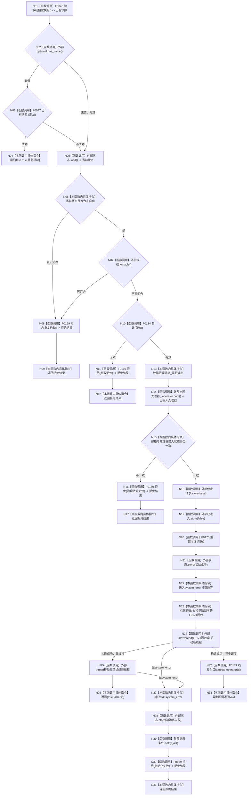

# CF-L4-0008 `自我线程::启动` 现状流程图

图类型：现状流程图
代码版本：`a48a70b2d678dea64dd8228adb4f26f0badd9506`
覆盖文件：`海中鱼巣/线程/自我线程.ixx:182-213`
唯一根函数：F0044
完整签名：`海中鱼巣::自我线程操作结果 海中鱼巣::自我线程::启动(const 海中鱼巣::自我根需求初始化参数& 参数)`
参数：`参数` 为调用期间有效的只读引用；线程闭包按值复制参数
返回结果：返回结构化启动受理、幂等复用或拒绝结果；受理成功不代表异步初始化已经成功
调用图：`流程图/代码流程图/00_调用知识图谱.md`
逐行映射表：`流程图/代码流程图/L4/CF-L4-0008_自我线程_启动_逐行代码映射表.md`
偏差清单：`流程图/代码流程图/00_规范偏差审计.md`
不得作为施工许可：是

## 项目源码调用合同

| ID | 函数 | 调用位置 / 次数 | 输入与结果 |
| --- | --- | --- | --- |
| F0046 | `std::optional<自我线程初始化快照> 自我线程::读取初始化快照() const` | 183 / 1 | 隐式 `this`；返回快照副本 |
| F0047 | `bool 自我线程初始化快照::成功() const` | 184 / 1 | 仅在快照有值时调用；返回完整性 |
| F0134 | `bool 自我根需求初始化参数::有效() const` | 190 / 1 | 参数只读；返回准入结果 |
| F0169 | `static 自我线程操作结果 自我线程::拒绝(自我线程拒绝原因)` | 188、191、196、210 / 4 | 具名原因；返回结构化拒绝 |
| F0170 | `void 自我线程::重置治理读数()` | 201 / 1 | 隐式 `this`；重置治理状态和九项读数 |
| F0171 | `void 自我线程::启动(...)::<lambda@204-206>::operator()() const` | 204-206 / 1 | 捕获 `this` 与参数副本；由新线程异步调用 |

## 并发、状态与异常边界

所有准入检查完成后，本函数才依次清除停止请求和进入标志、重置治理读数，并把状态发布为初始化中。`std::thread` 构造成功即可并发执行 F0171；异步初始化可能早于、晚于或穿插于父线程移动赋值和成功返回，故 `{true,false,无}` 只表示启动受理。

本函数没有串行化整个“检查状态—创建线程”区间。两个并发调用可能同时观察未启动且线程不可汇合，随后竞争写非原子 `线程` 成员；原子状态读写本身不能形成唯一启动所有权。`catch` 只接收当前线程 try 块中的 `std::system_error`，不接收线程入口内部异常；F0171 内未捕获异常会进入 `std::terminate` 边界。线程构造失败时，已重置的停止请求、进入标志和治理读数不恢复，只把状态改为初始化失败并通知等待者。

未解析调用：0。
